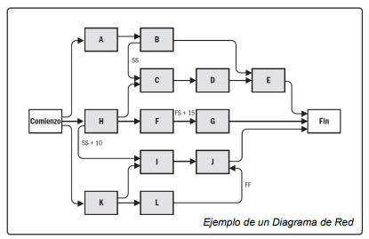
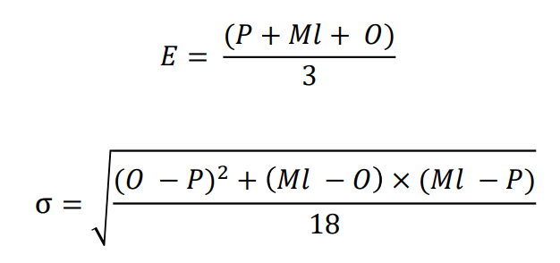
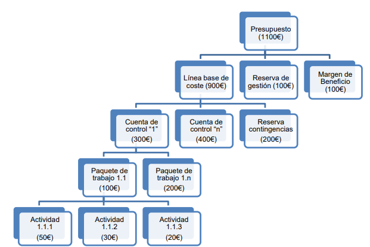

# Metodologías Tradicionales (Temas 1-7)

## Tema 1

### Introducción a la Gestión de Proyectos

***

#### Definición de proyecto:
- Un proyecto es un **esfuerzo temporal** que se lleva a cabo para **crear un producto, servicio o resultado único.**
- Un proyecto es un conjunto **único** de actividades destinadas a **producir** un **resultado** definido dentro de un **marco de tiempo** establecido utilizando una asignación específica de recursos.
- Un proyecto es un proceso **único** consistente en un conjunto de actividades coordinadas y controladas con **fechas de inicio y de finalización**, llevadas a cabo para **lograr un objetivo** conforme a unos **requisitos** específicos, incluyendo las **limitaciones de tiempo, coste y recursos**.

La producción continua de bienes y/o servicios **NO es un proyecto**. Eso recibe el nombre de operaciones y están fuera del alcance y se gestionan de forma diferente a los proyectos. Son repetitivos mientras los proyectos son temporales y únicos.

#### Características de los proyectos:
Los proyectos se llevan a cabo para cumplir **objetivos** mediante la producción de **entregables**.

- _**Objetivo:**_ **Producto** a producir, **servicio** a prestar, resultado a obtener o la **combinación** de los mismos. Debe ser único y específico
- _**Entregable:**_ Cualquier **producto, servicio o resultado único y específico** o la combinación de los mismos. Puede ser **tangible o intangible**. Naturaleza social, económica, material o ambiental.

Los proyectos son **esfuerzos temporales** en el sentido de que tienen un principio y un final definidos.
Se desarrollan de forma **progresiva** de acuerdo a una planificación **temporal** a lo largo de su **ciclo de vida**.

Se **finalizan** cuando:
- Se logran los objetivos
- Se constata que no se pueden cumplir
- Se agota la financiación
- Desaparece la necesidad del proyecto o se da por terminado por conveniencia o causa legal.

Pueden involucrar a **múltiples unidades de múltiples organizaciones**.
Requieren **coordinación multidisciplinar**.
Están **limitados por tiempo, coste y/o recursos**.

#### Dirección de proyectos:
La dirección de proyectos es la **aplicación de conocimientos, habilidades, herramientas y técnicas** a las **actividades del proyecto** para cumplir con los requisitos del mismo.

|Direccion de proyectos deficiente|Direccion de proyectos eficaz|
|-|-|
|Sobrecostes|Cumplir los objetivos del proyecto|
|Incumplimiento de plazos|Gestionar las restricciones del proyecto|
|Calidad deficiente|Optimizar los recursos disponibles|
|Expansión no controlada del proyecto|Responder a los riesgos de manera continua|
|Incumplimiento de objetivos|Gestionar los cambios|
|Pérdida de reputación|Ser más predecibles|

#### Restricciones de los proyectos
Todo proyecto está restringido por:
- **Alcance**: Trabajo/actividades para producir el resultado final.
- **Tiempo**: Cantidad de tiempo para completar el proyecto.
- **Coste**: Presupuesto disponible en el proyecto para realizar las actividades en el tiempo establecido.
- Estos tres elementos determinan la **Calidad**.

>- **Maximizar simultáneamente alcance, tiempo, coste y calidad no es posible.**
>- Además, se debe realizar una adecuada gestión de **riesgos** (sería la quinta restricción).
>- El equipo de dirección debe buscar un equilibrio entre las **5 restricciones contrapuestas**.
>- El balance de las mismas dependerá de los **objetivos y características** del proyecto.

Un proyecto tiene **éxito** cuando:
- Cumple su objetivo
- Se elaboran todos los entregables esperados
- Se termina a tiempo
- Se ajusta al presupuesto

#### Programas y portafolios
- Un **programa** es un **grupo de proyectos relacionados**, cuya gestión se realiza de manera coordinada para obtener beneficios que no se obtendrían si se gestionaran de forma individual.

- Un **portafolio** es una **colección de proyectos, programas, portafolios subsidiarios y operaciones** gestionados como un grupo para alcanzar objetivos estratégicos.

### Ciclo de vida de un proyecto

***

- El **ciclo de vida** de un proyecto es la **serie de fases** por las que pasa un proyecto desde su inicio hasta su conclusión.
  - Una **fase de un proyecto** es un conjunto de actividades, relacionadas de manera lógica, que culmina con la finalización de uno o más **entregables**. Son **acotadas en tiempo** y pueden ser **secuenciales, iterativas o superpuestas**.

Todo proyecto puede configurarse dentro de un **ciclo de vida genérico** compuesto por: **Inicio, Planificación, Ejecución y Cierre**.
- **Inicio:**
  - Elaborar el acta de constitución del proyecto
  - Identificar a los interesados
  - Analizar viabilidad del proyecto

- **Planificación:**
  - Elaborar el plan para la dirección del proyecto
  - Definir alcance, cronograma y presupuesto.
  - Planificar la gestión de riesgos
  
- **Ejecución:**
  - Dirigir, gestionar y monitorear el trabajo del proyecto
  - Adquirir recursos

Tipos de ciclos de vida:
  - **Predictivos**: El alcance, cronograma y coste se determinan en las fases tempranas del ciclo de vida. Pueden tener etapas, pero la gestión de cambios en el alcance es complicada.
  - **Adaptativos o ágiles**: El proyecto se lleva a cabo en varias iteraciones de corta duración y su alcance se define y aprueba al comienzo de cada una.
  - **Híbridos:** Combinan los ambos tipos anteriores.

Al conjunto de fases asociadas al **desarrollo de un producto, servicio o resultado** se le denomina **ciclo de vida del desarrollo del proyecto**. Estos pueden ser: **en cascada, iterativos, incrementales, ágiles o híbridos**.

_**Nota:** Cuando se sigue un ciclo de vida híbrido se usa predictivo para los elementos bien conocidos o fijos y adaptativo para el resto de elementos en evolución_.

Los ciclos de vida de los proyectos **NO son lo mismo** que los **ciclos de vida de los productos**, los cuales representan la evolución del producto **desde el concepto hasta la entrega, la madurez y el retiro**. Por tanto, aunque guardan relación **se definen y gestionan de manera independiente**.

Al final de cada fase del ciclo de vida se lleva a cabo un **punto de revisión de fase**. En este punto se toma una de las siguientes decisiones:
- Avanzar a la siguiente fase (con o sin modificaciones)
- Finalizar el proyecto
- Permanecer en la fase
- Repetir la fase o elementos de la misma

Para definir el cilo de vida de un proyecto se debe:
- Identificar y nombrar los criterios de entrada/salida para **todas las fases del proyecto**. Esto implica identificar y nombrar todas las fases asociadas al desarrollo de productos, servicios y resultados.
- Identificar los **procesos de la dirección de proyectos** que deben realizarse en cada fase identificada.

### Introducción a la Gestión de Proyectos de Desarrollo del Software

***

#### Características del software

El software es distinto a los productos de otras ingenierías, ya que es **intangible**, se **desarrolla** (no se fabrica) y los costes se centran en el desarrollo, no la fabricación. No se estropea pero **SÍ se deteriora**.

El software es más flexible y generalmente más barato de modificar.

Necesita **métricas específicas**:
- Para estimar su **tamaño**.
- Para estimar su **esfuerzo y coste de desarrollo**.
- Para medir aspectos de su **proceso de desarrollo**.
- Para medir su **calidad**.

Las características de un software de calidad son las siguientes:

|Característica|Descripción|
|---|---|
|**Aceptación**|Debe ser aceptado por los usuarios para los que ha sido diseñado.|
|**Usabilidad**|Los usuarios para los que ha sido diseñado deben poder utilizarlo fácilmente|
|**Fiabilidad**|Debe tener una baja tasa de fallos, los fallos que se produzcan deben ser poco graves y debe ser capaz de recuperarse tras un fallo|
|**Rendimiento**|Debe tener un bajo tiempo de respuesta y hacer un consumo eficiente de recursos|
|**Mantenibilidad**|Debe ser desarrollado para que pueda ser mantenido fácilmente|

#### Proyectos de desarrollo del software

Un **proyecto de desarrollo del software** es un proyecto que requiere **desarrollar productos software** que satisfagan unos **requisitos** determinados.

Presentan características propias, con **productos, ciclos de vida, métricas y comportamiento diferente**.

### Modelos de Proceso de Software

***

Los **modelos de proceso de software** son definiciones de alto nivel de los **ciclos de vida de los productos software**. Cada modelo propone una **secuencia de actividades que conduce a la elaboración de un producto software**.

La mayoría de modelos de proceso software tienen en común las siguientes actividades:
- **Especificación de requisitos**.
- **Diseño**.
- **Implementación**.
- **Integración.**
- **Verificación y Validación**.
- **Implantación**.
- **Mantenimiento**.

#### Modelo en cascada.

Clásico:

Con retroalimentación:

Con prototipado:

#### Modelo Incremental

#### Modelo Evolutivo

#### Modelo en Espiral

**Modelo iterativo y evolutivo** dirigido por **riesgos**.

Los **riesgos** se van detectando a medida que se va evolucionando y no al final.

El gestor del proyecto ajusta el número necesario de iteraciones para completar el software.

#### Metodologías ágiles

El **desarrollo ágil de software** tiene como objetivo reducir los costes provocados por cambios a lo largo del proceso de software.

Estas metodologías definen modelos de proceso **iterativos e incrementales**. Cada iteración incluye: especificación y análisis de requisitos, diseño, implementación, integración y pruebas.

Tratan de **diseñar y construir** el software simultáneamente.

- **Scrum**: Marco de trabajo que define un conjunto de prácticas, roles, eventos y artefactos.

- **Kanban**: Método para definir, gestionar y mejorar servicios que entregan trabajo del conocimiento.

- **XP (eXtreme Programming):** Método que incluye diversas prácticas como planificación de releases e iteraciones, desarrollo guiado por pruebas, programación en pares y refactorización.

## Tema 2

### Procesos de la Dirección de Proyectos

***

Los **procesos de la dirección de proyectos** definen una serie de **actividades de dirección** cuya ejecución permite gestionar el proyecto a lo largo de toda su vida.

Cada proceso produce **una o más salidas** a partir de **una o más entradas** mediante el uso de **herramientas y técnicas** adecuadas para la dirección de proyectos.

La salida de un proceso puede dar como resultado:
- Un **entregable** del proyecto
- Una **entrada** a otro proceso

Los procesos **se relacionan entre sí** a través de las salidas que producen.

Los procesos también pueden tener **actividades superpuestas (concurrentes)**.

**Procesos de utilización única**: Son procesos que se utilizan una única vez en puntos predefinidos del proyecto. *Ejemplo: Desarrollar el Acta de Constitución del Proyecto*

**Procesos de utilización recurrente**: Son procesos que se llevan a cabo siempre que sea necesario y que pueden ocurrir en múltiples ocasiones. *Ejemplo: Adquirir Recursos*

**Procesos de utilización continua**: Son procesos que se realizan de manera continua a lo largo de todo o parte del proyecto. *Ejemplo: Controlar los costes*

La **Guía del PMBOK** agrupa los procesos en **5 grupos** que **son independientes de las fases del ciclo de vida del proyectos**. El hecho de que un proceso peertenezca a un grupo determinado no limita las fases en las que éste puede ser aplicado.

En proyectos con **ciclos de vida ágiles** se pueden emplear procesos de todos los grupos en cada **iteración**:

La **Guía del PMBOK** también agrupa los procesos en **10 áreas de conocimiento**:

#### Adaptación de la dirección de proyectos

La adaptación de la dirección de proyectos es necesaria porque **cada proyecto es único**:
- Cada proyecto tiene diferentes **restricciones contrapuestas de alcance, tiempo, costes, calidad y riesgos con importancias distintas.**
- El equipo de dirección debe **adaptar** el enfoque para gestionar estas restricciones.

La **adaptación de la dirección de proyectos** consiste en seleccionar los **procesos de la dirección de proyectos, entradas, herramientas, técnicas, salidas y fases del ciclo de vida** adecuados para gestionar un proyecto.

Para realizar la adaptación, el director del proyecto colabora con el equipo del proyecto, el patrocinador, la dirección de la organización o alguna combinación de los mismos.

### Flujo de procesos PMBOK

***

#### Grupo de Procesos de Inicio

Procesos realizados para **definir un nuevo proyecto** o nueva fase de un proyecto existente.

##### Acta de constitución del proyecto

El acta es un documento emitido por el **iniciador o patrocinador** del proyecto, que autoriza la existencia del proyecto y confiere al director de proyecto autoridad para **planificar, ejecutar y controlar el proyecto**, así como para **asignar los recursos de la organización** a las actividades del mismo.

- Su aprobación constituye el **inicio formal del proyecto**.
- Puede ser elaborada por el **patrocinador y/o director del proyecto** en colaboración con la **entidad iniciadora**.
- No es considerada un contrato

Documenta la información acerca del proyecto y el producto, servicio o resultado que el proyecto pretende producir, incluyendo:

- **Objetivos del proyecto**.
- **Descripción general**, incluyendo los **entregables** clave.
- Resumen del **cronograma de hitos**.
- **Recursos financieros**.
- **Riesgo** general del proyecto.
- Lista de interesados clave.
- Criterios de salida y de éxito.
- Niveles de autoridad.

Beneficios del proceso:

- Crea un **registro formal** del proyecto.
- Muestra el **compromiso** de la organización.
- Proporciona un vínculo directo entre el proyecto y los **objetivos estratégicos** de la organización.

Para desarrollar el acta se requiere la elaboración previa de los siguientes documentos **que se originan fuera del proyecto y de sus límites**:

- **Caso de negocio**: Enumera los objetivos y razones para iniciar el proyecto e incluye un estudio de viabilidad económica.
- **Plan de gestión de beneficios**: Describe como medir los beneficios del proyecto.
- **Acuerdos** de los diferentes involucrados del proyecto.

##### Identificar a los interesados

Los **stakeholders** son aquellas personas, grupos u organizaciones que **pueden afectar al o ser afectados por el proyecto**.

Identificar, involucrar y gestionar correctamente a los interesados es **clave** para el éxito de un proyecto.

El proceso de identificación de los interesados debería comenzar **lo antes posible** una vez que el acta de constitución del proyecto ha sido aprobada.

#### Grupo de Procesos de Planificación

##### Plan para la dirección del proyecto

Es el proceso de definir, preparar y coordinar todos los componentes del proyecto y consolidarlos en un **plan integral para la dirección del proyecto**.

Define la manera en que **el proyecto será ejecutado, monitoreado, controlado y cerrado**.

Define el **alcance, cronograma y coste** del proyecto.

Define qué **recursos** son necesarios para llevar a cabo el proyecto y los organiza.

Incluye un plan de gestión de **riesgos**.

Es una declaración pensada para ser **revisada y modificada** con frecuencia, no un compromiso inalterable.

No pretende restringir la libertad de actuación, sino ser una **base para la gestión de la ejecución y cierre del proyecto.**

Sólo puede ser modificado a través del proceso "Realizar el Control Integrado de Cambios", lo que resulta en un plan que **se elabora progresivamente** por medio de **actualizaciones controladas**.

Integra y consolida **todos los planes de gestión, líneas base e información adicional necesaria para dirigir el proyecto**.

#### Grupo de Procesos de Ejecución

Procesos realizados para **completar el trabajo definido en el plan para la dirección del proyecto** a fin de satisfacer los requisitos del proyecto.

##### Dirigir y Gestionar el Trabajo del Proyecto

Es el proceso de **liderar y llevar a cabo el trabajo definido en el plan para la dirección del proyecto** e **implementar los cambios** aprobados para alcanzar sus objetivos.

Implica **ejecutar las actividades planificadas** del proyecto para completar los **entregables** del mismo y alcanzar los objetivos establecidos.

Se asignan los **recursos disponibles** y se gestiona su uso eficiente.

El **equipo de dirección del proyecto** dirige la ejecución de las actividades.

Se recopilan **datos de desempeño del trabajo** y se comunican a los **procesos de monitoreo y control**.

Se aplican los **cambios en los planes del proyecto** que provienen de analizar estos datos.

#### Grupo de Procesos de Monitoreo y Control

Procesos requeridos para **hacer seguimiento, analizar y regular el prograso y el desempeño del proyecto**, para identificar áreas en las que **el plan requiera cambios** y para **iniciar los cambios** correspondientes.

##### Monitorear y Controlar el Trabajo del Proyecto

Es el proceso de **hacer seguimiento, revisar e informar sobre el avance general del proyecto** a fin de cumplir con los objetivos de desempeño definidos en el plan para la dirección del proyecto.

Se realiza **de forma continua a lo largo de todo el proyecto**. Consiste en **recopilar, medir y evaluar medidas**.

Permite a la **dirección del proyecto**:

- Medir y supervisar regularmente el progreso del proyecto para **identificar variaciones respecto al plan** para la dirección del proyecto.
- **Identificar áreas** que puedan requerir medidas correctivas.
- **Monitorear la implementación de los cambios** realizados.
- **Realizar pronósticos**.
- Verificar el estado de los **riesgos** del proyecto.

Permite a los **interesados comprender el estado del proyecto** en un momento dado.

##### Realizar el Control Integrado de Cambios

Es el proceso de **revisar todas las solicitudes de cambio**, **aprobar y gestionar cambios a entregables, documentos del proyecto y al plan para la dirección del proyecto; y comunicar** las decisiones.

Se realiza de **forma continua desde el inicio del proyecto hasta su finalización**.

Cualquier interesado puede solicitar cambios, los cuales **pueden ocurrir en cualquier momento a lo largo del ciclo de vida del proyecto.**

Un cambio puede impactar:
- Al **alcance, cronograma y/o costes** del proyecto
- A cualquier componente del **plan para la dirección del proyecto** u otro documento.

#### Grupo de Procesos de Cierre

Este grupo está formado por un único proceso: **“Cerrar el Proyecto o Fase”**, el cual se lleva a cabo para **completar o cerrar formalmente un proyecto**, una fase o un contrato.

Este proceso permite **archivar la información del proyecto o fase, verificar que el trabajo planificado ha sido completado y liberar los recursos de la organización**.

Este proceso comprende:

- Confirmar la entrega y aceptación formal de todos los entregables por parte del cliente.
- Transferir los productos, servicios o resultados del proyecto a la siguiente fase o a producción y/u operaciones.
- Verificar que todos los costes puedan ser asignados al proyecto y cerrar las cuentas.
- Liberar y reasignar recursos (personal, equipamiento, …).
- Ocuparse del exceso de materiales.
- Medir la satisfacción de los interesados.
- Recopilar registros, auditar el éxito o fracaso del proyecto, identificar las lecciones aprendidas y archivar la información para uso futuro.
- Analizar y documentar las razones de las acciones emprendidas en caso de que un proyecto se dé por terminado antes de su culminación.
- Elaborar los informes finales del proyecto.

### Herramientas y Técnicas empleadas en los Procesos de la Dirección de Proyectos

***

**Dirigir un proyecto** requiere seleccionar las **herramientas y técnicas** más adecuadas para su gestión y aplicarlas a las actividades del proyecto. PMBOK identifica 132 herramientas y técnicas que pueden ser utilizadas y estas son las más utilizadas:

#### Juicio de expertos:

Es una técnica en la que un **grupo de personas con formación especializada** en un área de conocimiento emite una opinión sobre un tema concreto.

Se puede utilizar para la **toma de decisiones, la recopilación de información y la interpretación de resultados**.

#### Método Delphi

Basada en **juicio de expertos**, en la cual se les dan cuestionarios a los expertos y se analizan estadísticamente.

Permite alcanzar **consensos y realizar predicciones** cuantitativas mediante un **proceso iterativo y sistemático.**

#### Brainstorming

Tiene dos partes: **generación de ideas** (todos producen y expanden ideas) y **análisis** (se agrupan ideas similares y se evalúan).

Sirve para **recopilar datos, identificar listas de ideas o soluciones, generar ideas originales**.

#### Grupos focales

Reúnen a interesados y expertos en la materia a fin de **conocer sus expectativas y actitudes respecto a un producto, servicio o resultado propuesto.**

Sirve para **recopilar datos**.

#### Análisis mediante árbol de decisiones

Se utilizan para elegir el mejor curso de acción entre varias opciones. Para ello se analizan las trayectorias alternativas y cada uno de los nodos finales representa el resultado.

Es una técnica de **análisis de datos**.

#### Mapeo mental

Consiste en la elaboración de un diagrama (mapa mental) para representar y organizar **visualmente** elementos **ligados a una idea central**.

Es una técnica de **representación de datos**

#### Presentaciones

Presentaciones de diapositivas (se presentan varios consejos y reglas para que sean más efectivas).

Es una técnica del grupo **habilidades para la comunicación**.

#### Reuniones

Pueden ser **presenciales, virtuales, formales o informales** (se presentan varios consejos y reglas para que sean más efectivas).

Se debe planificar la reunión con antelación creando una agenda con el plan de la misma y distribuirla.

Es una técnica de **gestión de un proyecto**, con el objetivo de **tomar decisiones**.

#### Gestión de reuniones

Consiste en preparar y distribuir la agenda (estableciendo los objetivos y plan de reunión), y asegurar el curso, comienzo, registros, etc. de la reunión.

Es una técnica del grupo **habilidades interpersonales y de equipo**.

#### Liderazgo

Son los **conocimientos, habilidades y comportamientos necesarios para guiar, motivar y dirigir a un equipo/organización a alcanzar sus metas de negocio**.

Es una técnica de **habilidades interpersonales y de equipo**.

## Tema 3

### Gestión del Alcance

***

#### Definición y Planificación

El **alcance del proyecto** es **todo el trabajo que hay que realizar para cumplir su objetivo y completarlo con éxito.**

El **área de conocimiento Gestión del Alcance** incluye los procesos necesarios para garantizar que el proyecto **incluya única y completamente el trabajo requerido para completar el proyecto con éxito**.

**Ciclos de vida predictivos**: El alcance se define al **comienzo del proyecto**, definiendo una **linea base del alcance** que se valida **con cada entregable o revisión de fase**.

**Ciclos de vida ágiles/adaptativos**: El alcance se define a través de **múltiples iteraciones**, se utilizan registros de trabajos pendientes (requisitos, US, etc.) para ver el estado actual y se valida **en cada iteración**.

**Planificar la Gestión del Alcance:** Crear un plan de gestión.

#### Recopilar Requisitos

Proceso encargado de **determinar, documentar y gestionar las necesidades y requisitos de los interesados**.

La **ingeniería de Requisitos** es el área encargada de **identificar, especificar, validar, documentar y gestionar requisitos de software**.

**Requisito de software**: Condición o capacidad que debe alcanzar o poseer un **sistema o un componente de un sistema**, para **satisfacer un contrato, estándar, especificación u otro documento formal**, o para que un **usuario resuelva un problema o alcance un objetivo**.

Los requisitos deben ser: Necesarios, completos, no ambiguos, únicos, factibles, consistenmtes, trazables, verificables y libres de restricciones de implementación.

**Funcionales:** Especifican una función que un sistema o componente debe ser capaz de llevar a cabo.

**No funcionales**: Limitaciones sobre funciones o servicios que ofrece el sistema o características de calidad.

**Elicitación de requisitos**: Entrevistas, reuniones, casos de uso UML, prototipos, etnografía (observación en el entorno de trabajo), estudio de documentación del entorno profesional.

**Especificación de requisitos**: Proceso de escribir los requisitos en un **Documento Oficial del Proyecto (ERS)**.

#### Definir el alcance

**Definir el Alcance** es el proceso de desarrollar una **descripción detallada del proyecto y del producto o resultado final (enunciado del alcance del proyecto)**.

Hace uso de la documentación generada por el anterior proceso **Recopilar requisitos**.

Se describen y clarifican los **límites del proyecto**.

El **enunciado del alcance del proyecto** debe incluir:

- Descripción detallada del **proyecto**
- Descripción del **resultado final**
- **Límites** del proyecto
- **Supuestos y restricciones**
- **Riesgos**
- Descripción de los principales **entregables del proyecto**
- **Criterios de aceptación** de los mismos

#### Crear la EDT/WBS

**Crear la EDT/WBS** es el proceso de **dividir el alcance del proyecto** en componentes más pequeños y manejables.

- **EDT**: Estructura de Desglose del Trabajo

- **WBS**: Work Breakdown Structure

**La EDT/WBS** es una **descomposición jerárquica** de **todo el trabajo a realizar por el equipo del proyecto** para cumplir con el objetivo del proyectom crear los entregables requeridos y completar el proyecto con éxito.
- Incluye el **trabajo de dirección del proyecto** y el de **soporte**.
- También puede incluir **trabajo realizado por recursos externos** a la organización.

La EDT/WBS **define y organiza el alcance del proyecto** y representa el trabajo especificado en el **enunciado del alcance del proyecto**.

Cada **nivel descendiente** representa una **definición cada vez más detallada** del trabajo del proyecto.

Los componentes que forman el nivel más bajo de cada rama se llaman **paquetes de trabajo**.

Un **paquete de trabajo** es un **conjunto de actividades relacionadas** que pueden ser realizadas por recursos similares y de las que se puede estimar su **esfuerzo, duración y coste**.

Un paquete se puede utilizar para **agrupar actividades** donde el trabajo es programado, estimado, seguido y controlado.

Cada componente puede **requerir diferentes niveles de descomposición** hasta llegar al nivel de los paquetes de trabajo.

**Regla del 100%:** El trabajo representado por un componente es igual a la suma de todos los paquetes de trabajo inferiores.

**Cada paquete no puede tener más de un componente superior**.

El EDT/WBS se puede representar de varias formas, siendo la más habitual la **forma de árbol**.

Cada componente debe tener un **identificador único**.

En el **primer nivel de descomposición** se representa el **proyecto** en su totalidad o el **resultado final**.

Se pueden utilizar **dos enfoques diferentes**:

1. Utilizar los **principales entregables** del proyecto como **segundo nivel** de descomposición
2. Utilizar las **fases del ciclo de vida del proyecto** como **segundo nivel** de descomposicióm, con los entregables insertados en el **tercer nivel**.

También existen guías y plantillas específicas para elaborar EDT/WBS en áreas específicas (como la **ingeniería del software**).

Se puede acompañar de un documento (**diccionario de la EDT/WBS**) que proporcione información detallada sobre cada uno de sus componentes.

Constituye la **base para la planificación temporal, la gestión de recursos y la estimación de costes**.

Sirve como **herramienta comunicativa**.

**No representa cronología** ni dependencias entre actividades del proyecto.

### Estructura de Desglose del Producto

***

La EDP/PBS  es una estructura jerárquica de todos los **entregables** que se deben producir para generar el **resultado final**.

Incluye **todos los productos** que se desarrollarán a lo largo del proyecto.

Se representa y crea igual que la EDT/WBS con las siguientes peculiaridades:

- En el **primer nivel de descomposición** se representa siempre el resultado final del proyecto (generalmente un **producto**)
- Todos los componentes deben ser **entregables del proyecto o conjuntos de los mismos** y la estructura se debe **organizar por entregables**
- No se usa el término paquetes de trabajo

|EDT/WBS|EDP/PBS|
|---|---|
|Incluye **paquetes de trabajo**|Incluye **entregables**|
|Divide el **alcance del proyecto**|Divide el **resultado final**|
|Permite comunicar el **trabajo que hay que ejecutar**|Permite comunicar **los resultados que el proyecto va a producir**|
|Se define **después**|Se define **antes** (y puede ayudar a crear el EDT/WBS)|

La EDP/PBS divide el **resultado final** del proyecto mientras que la EDT/WBS divide todo el **alcance del proyecto**.

## Tema 4

### Planificación Temporal de Proyectos

***

La planificación temporal **facilita que todas las actividades del proyecto sean ejecuradas a tiempo**, aumentando las probabilidades de éxito del proyecto.

Una mala planificación temporal puede dar lugar a retrasos en los entregables, incumplimiento de objetivos, sobrecostes, estrés, etc.

La guía del PMBOK identifica procesos necesarios para una **correcta y completa planificación temporal de proyectos**, pertenecientes al área de conocimiento **Gestión del cronograma del Proyecto** (algunos también pertenecen a **Gestión de los Recursos del Proyecto**).

### Gestión del Cronograma del Proyecto

***

**Planificar la Gestión del Cronograma**: Proceso de establecer políticas, procedimientos y documentación para planificar, desarrollar, gestionar, ejecutar y controlar el cronograma del proyecto.

**Definir las Actividades**: Proceso de identificar y documentar las acciones específicas que se deben realizar para elaborar los entregables del proyecto.

**Secuenciar las Actividades**: Proceso de identificar y documentar las relaciones entre las actividades del proyecto.

**Estimar la Duración de las Actividades**: Estimar la cantidad de periodos de trabajo necesarios para finalizar las actividades individuales con los recursos estimados.

**Desarrollar el Cronograma**: Analizar secuencias de actividades, duraciones, requisitos de recursos para crear el cronograma del proyecto para su ejecución, monitoreo y control.

#### Cronograma del proyecto

El **cronograma del proyecto** proporciona un **plan detallado** que representa el modo y el momento en que el proyecto entregará los productos, servicios y otros resultados definidos en el enunciado del alcance.

El cronograma presenta las **actividades e hitos** del proyecto:

- Para cada actividad: **duración estimada, fecha de inicio planificada, fecha de finalización planificada y recursos asignados**.
- Para cada hito: su **fecha planificada**.
- **Relaciones lógicas y dependencias entre actividades**.

Utilidades:

- Establece la **planificación temporal**.
- Base para controlar el **desempeño del proyecto**.
- Herramienta de **comunicación**.
- Gestionar las **expectativas de los interesados**.

Se suele representar de forma gráfica usando **diagramas de Gantt** o **diagramas lógicos de barras**:

#### 1. Definir las actividades

Se deben descomponer los **paquetes de trabajo identificados en las EDT/WBS en actividades del proyecto**.

De cada actividad debe ser posible estimar su **esfuerzo, duración y coste**.

Estas actividades compondrán el cronograma y proporcionarán una base para la programación, estimación, ejecución, monitoreo y control de trabajo del proyecto.

Para **cada actividad** se debe definir: Identificador único, nobre, paquete de trabajo al que pertenece, descripción general, restricciones y otra info.

#### 2. Definir la lista de hitos

Un **hito** es un **punto o evento significativo** dentro del proyecto.

A diferencia de las actividades, **los hitos no consumen esfuerzo, tiempo ni recursos** del proyecto. **Tienen una duración nula**, ya que representan un punto o evento significativo.

La **lista de hitos** de un proyecto identifica todos los hitos del proyecto e indicada si son obligatorios u opcionales.

#### 3. Secuenciar las actividades

Consiste en definir la **secuencia lógica de trabajo para obtener la máxima eficiencia** teniendo en cuenta todas las restricciones del proyecto.

Cada actividad se debe conectar con al menos una **actividad predecesora y sucesora**.

Las relaciones lógicas entre las actividades deberían dar lugar a un cronograma del proyecto realista y viable.

Como resultado de la secuenciación de actividades se puede obtener un **diagrama de red del cronograma del proyecto.**

#### 4. Estimar la duración de las actividades

**Estimar los recursos de las actividades** es un proceso que consiste en estimar los recursos humanos y físicos necesarios para ejecutar el trabajo del proyecto.

Este proceso pertenece al área **Gestión de los recursos del Proyecto**.

La **estimación de la duración de las actividades** utiliza información acerca de las cantidades estimadas de recursos y sus calendarios de utilización.

La estimación de recursos de las actividades debe realizarse antes de estimar su duración.

Establece la **cantidad de tiempo necesario** para finalizar cada una de las actividades del proyecto con los recursos estimados.

Requiere estimar previamente el **esfuerzo** requerido para completar las actividades así como sus refuerzos.

En muchos casos la cantidad de recursos disponible pra llevar a cabo una actividad puede determinar su duración.

También se pueden tener en cuenta diferentes **niveles de eficiencia** para los recursos (un programador junior no es igual de eficiente que uno senior).

La relación entre la duración y los recursos asignados **no es lineal** (el rendimiento decrece).

Existen métodos y métricas específicas pra estimar la duración de proyectos y tareas de desarrollo de **software**.

Para cada actividad se debe obtener:
- Recursos asignados
- Duración estimada
- Información sobre cómo se obtuvieron las estimaciones

#### 5. Desarrollar y documentar el cronograma

Consiste en crear y documentar un **modelo de programacion** con **fechas planificadas de inicio y finalización** para cada una de las **actividades del proyecto**, así como **fechas planificadas para los hitos**.

Existen diferentes **técnicas**: Método de la ruta crítica, técnicas de optimización de recursos y técnicas de compresión del cronograma.

Para tratarse de una representación completa el cronograma debe incluir:
- **Identificador** de cada actividad e hito del proyecto
- **Duración, fecha de inicio y fecha de finalización** de cada actividad
- **Fecha planificada** de cada hito
- **Relaciones y dependencias** entre actividades.
- **Recursos asignados** (opcional)

La representación del cronograma debe ir acompañada de una serie de **datos del cronograma** a fin de **describir el cronograma y facilitar su control**.

Los datos deben incluir: Una lista completa de las actividades e hitos, atributos finales de las actividades y documentación de los supuestos y restricciones.

### Diagramas de Red del Cronograma del Proyecto

***

Un **diagrama de red** es una **representación gráfica** de las relaciones lógicas, también denominadas **dependencias**, entre las actividades del cronograma.

Se emplean para elaborar el cronograma del proyecto, así como para **analizarlo y mejorarlo**.

Los diagrmas se pueden crear **una vez secuenciadas las actividades** del proyecto y pueden ser actualizados tras estimar las duraciones de estas actividades.

Existen dos tipos principales de diagramas: **PDM** (Precedence Diagramming Method) y **ADM** (Arrow Diagramming Method).

#### PDM

Las actividades se representan mediante **nodos**, generalmente con aspecto de caja.

Las dependencias son **flechas**, y existen cuatro tipos:

- **Final a Inicio (FS)**: La actividad sucesora no puede comenzar hasta que haya concluido la predecesora
- **Final a Final (FF)**: La actividad sucesora no puede finalizar hasta que haya concluido la actividad predecesora
- **Inicio a Inicio (SS)**: La actividad sucesora no puede comenzar hasta que haya comenzado la actividad predecesora
- **Inicio a Final (SF)**: La actividad sucesora no puede finalizar hasta que haya comenzado la actividad predecesora

La relación FS es la más comúnmente utilizada, dos actividades pueden tener dos relaciones lógicas al mismo tiempo aunque se recomienda **emplear sólo una**. También se desaconseja el uso de circuitos cerrados.

#### ADM

Las **actividades** se representan mediante **flechas**.

Las **dependencias/relaciones** se representan mediante **nodos circulares**.

Todas las relaciones entre actividades son **FS**.

También se puede hacer uso de actividades ficticias:

**PDM es ventajoso frente a ADM** debido a que PDM no requiere actividades ficticias, permite incluir retrasos y adelantos, se pueden definir más tipos de relaciones y elabora diagramas de red con mayor información.

#### Método de la Ruta Crítica (CPM)

La **ruta crítica** es la secuencia de actividades **más larga**, la que determina la **menor duración posible** del proyecto.

La red de un cronograma puede tener **varias rutas críticas**.

EL método de la ruta crítica es una **técnica de análisis** del cronograma. que se utiliza para **estimar la mínima duración del proyecto y determinar el nivel de flexibilidad** de la programación de los diferentes cambios del cronograma.

La holgura es el tiempo que se puede retrasar o extender una actividad sin que afecte a la fecha de finalización del proyecto.

Se calcula como la **diferencia de tiempo entre lo más tarde que se puede finalizar y lo más pronto que se puede finalizar** (o viceversa con empezar).

Una **actividad crítica** es aquella cuya **holgura es cero**, por tanto cualquier retraso en su ejecución retrasa el proyecto completo.

Toda **actividad crítica** pertenece a una **ruta crítica**, aunque no todas las actividades de una ruta crítica tienen por qué serlo.

Para calcular los caminos críticos, la mínima duración del proyecto y la holgura de las actividades **usando CPM y PDM** se hace lo siguiente:
1. **Dibujar el diagrama de red** empleando PDM, incluyendo las **duraciones estimadas** de todas las actividades.
2. **Paso hacia adelante (Forward Pass)**: se calculan los valores Early Start y Early Finish para cada actividad a fin de conocer la duración mínima del proyecto.
3. **Paso hacia atrás (Backward Pass)**: Se calculan los valores LS y LF para cada actividad.
4. **Cálculo de holguras y rutas críticas**.

Una forma de dibujar el diagrama de red consiste en representar los nodos así:

Tras aplicar los pasos anteriores acabaríamos con un diagrama de este estilo:

Los valores obtenidos no constituyen necesariamente el cronograma del proyecto, sino que indican los periodos de tiempo dentro de los cuales de podrían llevar a cabo las actividades.

### Gestión de los Recursos del Proyecto

***

El área de conocimiento de **Gestión de los Recursos del Proyecto** incluye los procesos para identificar, adquirir y gestionar los recursos necesarios para la conclusión exitosa del proyecto.

Se abarca la gestión de dos tipos de recursos:

- **Recursos humanos**: personal que compone el equipo del proyecto. El equipo consiste en **individuos con roles y responsabilidades** y que trabajan en conjunto. Su participación en la toma de decisiones y planificación es beneficioso. El director del proyecto debe ser capaz de **liderar y gestionar**, así como de velar por la **formación del equipo y su satisfacción y motivación**.

- **Recursos físicos**: equipamiento, materiales, suministros e infraestructura. Su mala gestión puede dar lugar a **retrasos, deterioro de calidad o reducción de beneficios**.

Los recursos se obtienen por medio de un **proceso de adquisición** (que se realiza en la etapa de ejecución).

#### Planificar la Gestión de Recursos

Da como resultado el **plan de gestión de recursos**, que es parte del plan para la dirección del proyecto y proporciona una guía sobre cómo se deberían **categorizar, asignar, gestionar y liberar los recursos del proyecto**.

Documenta los **roles y responsabilidades de todos los recursos internos y externos a la organización**.

Resulta útil para **desarrollar el cronograma y determinar el presupuesto**.

También puede afectar a áreas como **riesgos y calidad**.

El plan debe asegurar que **Todo paquete de trabajo de la EDT/WBS o actividad tenga un dueño inequívoco** y todo  miembro del equipo tenga algún tipo de responsabilidad.

##### Matriz de asignación de responsabilidades (RAM)

Es una matriz que ilustra las **relaciones entre los paquetes de trabajo o actividades y los recursos internos y externos** a la organización.

Es útil para garantizar una asignación clara de **funciones y responsabilidades**.

Evita confusiones sobre quién es el respondable o tiene autoridad sobre cada parte del trabajo.

La **matriz RACI** define cuatro roles con diferente responsabilidad:
- **Responsible - Encargado:** Persona o recurso que realmente realiza la actividad.
- **Accountable - Responsable:** Persona o recurso responsable de que la actividad se lleve a cabo y deberá rendir cuentas.
- **Consulted:** Persona o recurso al que see deba consultar por su información o capacidad necesarias.
- **Informed:** Persona o recurso que debe ser informado sobre el avance, incidentes o resultados de la actividad.

Un mismo recurso puede tener varios roles sobre la misma actividad (por ejemplo R/A).

Toda actividad debe tener **un recurso con el rol R y únicamente un recurso con el rol A**.

La **matriz RASCI** añade el rol de **Support** asignado a todo recurso que seba estar a disposición de los recursos con rol R.

##### Estructura de desglose de la organización (OBS)

Es una **representación jerárquica** de la organización del proyecto que ilustra la relación entre las actividades y los recursos.

Se ordena según **unidades organizativas**, lo que permite a cada una **consultar todas sus responsabilidades** dentro del proyecto.

Se representa en forma de **diagrama de árbol acompañado de una matriz de asignación de responsabilidades (RACI)**.

##### Estructura de desglose de recursos

Es una **representación jerárquica** de los recursos del proyecto **organizados por categoría y tipo**.

**Categorías**: Recursos humanos, equipamiento, materiales, suministros, infraestructura, etc.

**Tipos**: Pueden incluir cualquier info. relevante, como nivel de habilidad, nivel de formación, etc.

## Tema 5

### Estimación de Esfuerzo, Tiempo y Coste en Proyectos de Software

***

Una **estimación** es una **predicción** para la cual se considera que existe una probabilidad superior a cero de que sea cierta.

Las **estimaciones** son fundamentales para el **éxito de cualquier proyecto**.

Durante la **planificación**, estimar permite tener una guía para la **toma de decisiones** (asignación de recursos, planificación temporal, elaboración de presupuesto, etc.)

Estimar sirve para: analizar la **viabilidad** del proyecto, establecer y acordar **objetivos**, acordar tiempo de ejecución y presupuestos y poder realizar **seguimiento**.

Las estimaciones se vuelven **más precisas** conforme avanza el proyecto.

Una buena estimación debe ser:

- **Repetible**: Una estimación se debe poder realizar en diferentes momentos del ciclo de vida.

- **Validada**: Las estimaciones deben ser revisadas por terceros en cuanto a su completitud, precisión y calidad.

- **Documentada**: Deben documentarse suficientemente para que se puedan **interpretar correctamente los resultados** y puedan ser **comprendidas, repetidas y validadas**.

- **Múltiples responsables**: Las estimaciones deben poder ser realizadas por varios integrantes del equipo.

- **Emplea diferentes técnicas**: Se pueden contrastar resultados y puede hacer uso de **datos históricos**.

- **Planificada**: Las estimaciones forman parte de las tareas del proyecto y **deben ser tratadas como una actividad más**. Se deben completar **recursos planificados**.

Si ya de por sí es difícil estimar en el software (personas-mes, calidad del software, etc.) con frecuencia se debe  estimar **con poca información del proyecto y sin datos históricos**.

Se pueden aplicar factores de ajuste para completar aspectos no tenidos en cuenta en el cálculo de las estimaciones: tareas de gestión, reuniones, hábitos de trabajo.

Existen muchas **técnicas de estimación**, que se pueden aplicar a un proyecto completo, a parte del mismo y se pueden combinar entre sí (Algunas necesitan combinarse con técnicas diferentes sí o también).

#### Estimación ascendente

Se estima la **duración, coste o esfuerzo** de cualquier proyecto o componente como la suma de las estimaciones de sus componentes de nivel inferior.

Se utiliza frecuentemente durante la planificación para estimar la **duración total** a partir del cronograma y el **presupuesto** a partir del coste de las actividades o paquetes de trabajo.

#### Estimación descendente

Es inversa e idéntica a la estimación ascendente.

Se puede utilizar en proyectos con duración/presupuesto fijos para repartir o para estimar componentes inferiores a uno que haya sido estimado mediante otra técnica.

La estimación ascendente es **más precisa** que la desdendente pero requiere más tiempo y esfuerzo.
En ocasiones, se combinan ambas técnicas, usando por ejemplo la estimación ascendente para refinar la descendente después de hacerla.

#### Estimación de tres valores

Es una técnica utilizada para estimar a partir del cálculo de **tres valores: estimación pesimista, estimación más probable y estimación optimista**.

Se emplea cuando existe **mucha incertidumbre** en la estimación (hay poca información).

Permite **mejorar la exactitud de las estimaciones** de esfuerzo, duración o coste por **un único valor de una actividad**, así como definir un **rango aproximado para las mismas**.

Permite obtener un **valor estimado (E)** y una **desviación típica (σ)** a partir de esos tres valores, cuya fórmula varía en función de la distribución de la probabilidad:
- **Distribución Normal**: El valor más probable se sitúa en el centro y está a la misma distancia del pesimista que del optimista.

- **Distribución Beta**: Distribución asimétrica donde el valor más probable está desplazado a uno de los extremos.

- **Distribución triangular**: A los tres valores se les da el mismo peso.

#### Juicio de expertos y método Delphi

Ambos se basan en expertos con formación/experiencia en un área de conocimiento concreto para pedirles opinión. El método Delphi permita realizar predicciones cuantitativas mediante un proceso iterativo y sistemático.

#### Estimación por analogía

Permite estimar utilizando **datos históricos** de actividades o proyectos **similares**.

Es menos costosa que otras técnicas, pero es menos precisa.

#### Estimación Paramétrica

Técnicas de estimación en las que se utilizan **modelos basados en ecuaciones o algoritmos** para estimar en base a **datos históricos y diferentes variables**.

En proyectos de software estas técnicas se usan para **estimar el esfuerzo** en función de variables tales como el tamaño del software, el tipo de aplicación y las características del equipo de desarrollo.

### Técnicas de Estimación Paramétrica para Proyectos de Software

***

Para estimar el tamaño del software, se pueden emplear **medidas técnicas o medidas funcionales**.

#### Medidas técnicas

Son medidas de **aspectos técnicos del software** como la **cantidad de líneas de código**, el número de ficheros fuente o la cantidad de páginas de documentación generadas.

Deben ser realizadas **a posteriori**, una vez el software ya ha sido implementado. Por tanto, los resultados son **exactos y no sujetos a interpretación**.

#### Medidas funcionales

Son medidas **enfocadas a contabilizar componentes funcionales** del software, como las entradas y salidas de datos o el número de entidades.

Emplean **elementos del negocio entendibles por los usuarios finales del sistema**.

Se pueden realizar **a priori**, por tanto son **independientes de la implementación** y la tecnología.

|Medidas Técnicas|Medidas Funcionales|
|---|---|
|**Exacto y objetivo**|Los resultados pueden cambiar en función de quién la realice|
|Se pueden realizar de **manera automática**|Deben ser realizadas por especialistas y requieren más esfuerzo|
|**NO** depende de la documentación|Depende de la documentación|
|Deben ser estimadas durante la planificación|Se pueden realizar **desde etapas muy tempranas del desarrollo**|
|Son inservibles para actividades no asociadas con aspectos técnicos|**Sirven para "cualquier" actividad**|
|Aunque sea exacto, su definición puede ser imprecisa|La medida **NO tiene ambigüedad** (aunque los resultados son subjetivos)|
|Sólo pueden ser entendidas por personas con conocimientos de software|Al emplear elementos del dominio del negocio **pueden ser entendidas por los usuarios finales**|
|Dependencia del entorno tecnológico, metodológico y humano|**Independientes del entorno**, permiten comparar al margen de su implementación|

#### Métodos empíricos de estimación de software

Son modelos que permiten estimar empleando **ecuaciones** obtenidas mediante **técnicas de regresión** a través de **datos históricos de proyectos ya finalizados**.

La mayoría estima el Esfuerzo **definiendo a, b y c** en la siguiente ecuación:

Estos tres valores se calibran a partir de los datos históricos.

##### - COCOMO I

(Luego se explica)

##### - Modelo de Putnam

Es un modelo **empírico** que permite estimar el **esfuerzo o tiempo** necesario para completar un software de un determinado tamaño.

Se basa en que el esfuerzo de desarrollo realizado a lo largo del proyecto sigue la **distribución de Rayleigh**.

Muchos otros modelos se basan en LOC (como COCOMO I) y hacen uso de la siguiente ecuación no lineal:

#### Métodos de medición en Puntos Función

Son una medida del **tamaño** en base únicamente a sus **requisitos funcionales**.

Aunque todos los métodos miden el tamaño funcional, cada método **define distintas métricas y reglas para ello**.

El método a elegir puede considerarse en base a **diferentes factores**: Tipo de aplicación, tiempo y recursos disponibles o la necesidad de comparar el software con sistemas de terceros.

Existen otros métodos, como los **Feature Points** (útil para tener en cuenta la **complejidad de sus algoritmos**), los **Puntos Objeto** (para medir en función de **objetivos de negocio**) o **Puntos Casos de Uso** (usando los actores y factores de ajuste en los mismos).

##### - IFPUG-FPA (Function Point Analysis)

Fue el primer método de medición en puntos función y es **estándar de facto**.

El resto de métodos parten de los conceptos de IFPUG-FPA.

Consta de un total de **7 pasos**, aunque son 5 los que constituyen su parte **aprobada como estándar**.

##### - SiFP (Simple Function Points)

Pretende ser más **sencillo y rápido de aplicar**. Su principal objetivo es reducir el esfuerzo necesario para la estimación y medición del software.

Los resultados de IFPUG-FPA y SiFP son compatibles, en gran parte sus resultados son iguales.

Introduce el concepto de **capa** (muy útil para algunas arquitecturas), la cual tiene funcionalidades completas y significativas y sólo puede comunicarse con la se arriba y abajo.

Una **MSA (Measurable Software Application)** es una agregación de componentes cuyo tamaño puede ser medido.
Cada una pertenece a una sola capa, y debe tener unos **límites claros**.

Un **BFC (Base Functional Component)** es una unidad indivisible de requisitos funcionales. Existen dos tipos:

###### UGEP (Proceso Elemental Genérico No Especificado)

Tiene fines de **procesamiento de datos**, el cual incluye todas las actividades automatizadas, obligatorias y opcionales necesarias para su consecución.

Los procesos de **entrada de datos externos, salida de datos y consulta de datos** son UGEPs.

###### UGDG (Grupo de Datos Genérico No Especificado)

Tiene fines de **almacenamiento de datos**, refiriendo a un **conjunto de datos lógicos** de interés para el usuario.

No se diferencia entre conjunto de datos interno y externo, sino a todo aquel de interés para el usuario.

&NewLine;
&NewLine;

El proceso de medición de SiFP se compone de **6 pasos**:

###### Paso 1: Reunir la documentación disponible

A partir de la documentación, debería ser posible identificar las MSAs y BFCs.

###### Paso 2: Identificar las MSAs involucradas

Esta identificación de MSAs y sus límites se debe realizar desde el **punto de vista del usuario**.

###### Paso 3: Determinar el alcance de la medición

Cada MSA debe ser **medida por separado** y el resultado final de la medición debe ser calculado como la **suma de los puntos función** de cada una de ellas.

###### Paso 4: Identificar los BFCs

Por cada MSA hay que identificar los BFCs y elaborar una **lista de UGEPs y UGDGs**.

Para hacerlo, cada uno debe aparecer una sola vez.
Todo conjunto de datos usado por un UGEP debe ser considerado un UGDG.

Se consideran iguales si dos UGEP sólo difieren en el formato de presentación o tecnología o si dos UGDG se refieren al mismo conjunto de datos.

###### Paso 5: Calcular el tamaño funcional

El tamaño funcional de una MSA se puede calcular:

El tamaño de un software compuesto de N MSA se calcula:

###### Paso 6: Documentar el resultado de la medición

Se debe documentar el resultado final, el alcance, supuestos, lista, estándares empleados, fecha, personal implicado, etc.

##### - COSMIC-FFP

Es considerado el primero de **segunda generación** y es el 2o más utilizado en la industria.

Está diseñado para medir **aplicaciones en tiempo real**

En este método se obtiene el tamaño como un valor proporcional al número de **movimiento de datos**.

Asume la división en **capas** del software, dividiendo las mismas en **componentes** que recogen **procesos funcionales**.

El tamaño se obtiene como la suma de los **movimientos de datos** de sus procesos funcionales.

##### - NESMA

Se ajusta mejor a proyectos de **mejora y mantenimiento del software**. Diferencia entre **funcionalidades nuevas, modificadas y eliminadas**.

Utiliza una unidad de medida diferente, llamada **puntos función de mejora**.

También propone dos alternativas para hacer **estimaciones tempranas del software**.

##### - MKII-FPA

Adoptado por la United Kingdom Software Metrics Association.

Utiliza una unidad diferente a los puntos función, aunque se han presentado **fórmulas de conversión**.

##### - FiSMA

Pretende medir **todo tipo de aplicaciones software**. Es un método orientado al servicio, en lugar de identificar los procesos funcionales, se identifican **los servicios que éste proporciona**.

##### - SNAP

Fue creado para complementar IFPUG-FPA, ya que permite medir el tamaño en base a requisitos **no funcionales**.

Sus resultados se expresan en puntos SNAP y complementan a los puntos función de IFPUG-FPA.

### COCOMO I & II

***

#### COCOMO I

Es un modelo empírico que permite estimar en base a la **cantidad de líneas de código**.

Asume que el proceso de desarrollo sigue un **modelo en cascada clásico** y **lenguajes de programación imperativos** (C, Pascal, etc.).

Define tres **modelos** diferentes en función de la **precisión** deseada en las estimaciones:

- **Básico**: Sólo se basa en el tamaño en líneas de código.

- **Intermedio**: Añade atributos para características del software, hardware, equipo de desarrollo o proyecto.

- **Detallado**: Similar al intermedio, pero cambian los atributos para cada fase del ciclo de desarrollo.

Además define tres **modos** en función de la experiencia del equipo: **orgánico** (desarrollo sencillo, equipo con amplia experiencia), **semi-acoplado** (poca o nula exp.) y **empotrado** (desarrollo complejo, exp. limitada o nula).

Fórmula para calcular el **esfuerzo**:

Fórmula para calcular el **Tiempo mínimo de desarrollo**:

Se pueden calcular los **recursos** necesarios con la relación **E/Td**

La duración del proyecto se estima así:

Los **15 atributos** del factor de ajuste **m(X)** toman valores entre **Muy Bajo-Extra Alto**, lo que les da un valor numérico según una tabla.

3 dependen del **software**, 4 del **hardware**, 5 del **equipo de desarrollo** y 3 del **proyecto**.

Tras estimar el software usando COCOMO I se pueden estimar sus **actividades** usando la técnica de **estimación descendiente**.

Sin embargo, COCOMO I tiene **limitaciones**:

- Se debe utilizar un **modelo en cascada clásico y lenguaje imperativo**.
- Requiere estimar con precisión las LOC antes de desarrollar el software.
- Sólo considera las fases de **diseño, implementación y pruebas**, considerando **requisitos inalterables**.
- Para calibrar COCOMO I se necesita una gran cantidad de **datos históricos**.

#### COCOMO II

Es el modelo sucesor a COCOMO I, y se actualizó para adaptarse mejor a las **nuevas prácticas de desarrollo**.

Define **tres modelos diferentes** utilizados en etapas diferentes del ciclo de vida:

- **Modelo de composición de la aplicación**: Se utiliza para estimar el esfuerzo de desarrollo de **prototipos**. El tamaño se mide en **puntos objeto**.

- **Modelo de diseño temprano**: Se utiliza **una vez definidos los requisitos**. Requiere calcular el tamaño como puntos función mediante IFPUG-FPA y luego traducirlos a LOC.

- **Modelo de post-arquitectura**: Se utiliza **a partir del momento en el que se empieza la implementación** (se conoce la arquitectura). También requiere traducir mediante IFPUG-FPA, pero diferencia líneas de código **nuevas, modificadas y reutilizadas**. Estima b mediante **factores de escala** y utiliza 17 atributos para precisar el valor de ajuste.

## Tema 6

### Gestión de riesgos

***

Un **riesgo individual del proyecto** es un **evento o condición incierta** que afecta por lo menos a uno de los objetivos.

Pueden tener una o más **causas** y un efecto **tanto positivo como negativo**.
Si sucede, puede tener uno o más **impactos**.

Para que algo sea considerado un riesgo es necesario **poder gestionarlo**.

La organización puede lidiar con el riesgo según su **actitud frente al riesgo**. Está determinada por:
- Apetito por el riesgo
- Tolerancia al riesgo
- Umbral de riesgo

El **riesgo general del proyecto** es el efecto de la **incertidumbre sobre el proyecto** en su conjunto, incluyendo todos los riesgos individuales. Puede ser **positivo o negativo**.

El area de conocimiento **Gestión de Riesgos** incluye los procesos de **planificación de la gestión, identificación, análisis, planificación e implementación de respuesta y monitoreo de los riesgos** de un proyecto.

### Planificar la Gestión de los Riesgos

***

La planificación de la gestión de riesgos debe completarse en las **fases tempranas** de la planificación del proyecto.

En ella se definen aspectos relacionados con la gestión de riesgos:

- **Estrategia** de riesgos
- **Metodología**
- **Roles y responsabilidades**
- **Financiamiento**
- **Calendario/periodicidad**
- **Categorías de Riesgo** (EDR/RBS)
- Definiciones de **probabilidades e impactos**
- **Matriz de probabilidad e impacto**
- **Tolerancias** o apetitos al riesgo
- Formatos de informe de riesgos: **Registro de riesgos**
- **Seguimiento**

#### EDR/RBS

Es propia de cada proyecto, recoge las categorías de riesgos del proyecto, sirve de entrada al proceso de identificación de riesgos y **se debe revisar** a lo largo del proyecto.

#### Definición de probabilidades e impactos

### Identificar los riesgos

***

Explorar las posibles **causas o fuentes de riesgo** facilita la identificación (se puede hacer uso del **EDR/RBS**).

A partir de las **causas** se pueden detectar uno o más eventos de riesgo y sus respectivsos efectos en el proyecto.

Existen varios **tipos de riesgos**:
- Relacionados con la planificación
- Asociados con las tecnologías
- De contexto organizativo
- De recursos humanos
- De contexto externo

Varias de las técnicas para identificar riesgos son:
- Juicio de expertos, tormentas de ideas y reuniones
- **Listas de verificación** (Info histórica y conocimiento acumulado)
- Análisis de causa raíz (ACR/RCA)
- **Análisis de documentos**
- **Análisis de supuestos y restricciones**
- **Análisis FODA/SWOT**

#### Análisis FODA/SWOT

Este análisis comprende:

- Creación del grupo de análisis con diferentes perfiles
- **Análisis interno**: Identificación de fortalezas y debilidades de la organización
- **Análisis externo**: Identificación de amenazas y oportunidades
- Evaluación en consecuencia de las posibilidades de actuar frente a estos riesgos

### Análisis Cualitativo de Riesgos

***

Su objetivo es mejorar el desempeño centrándose en los **riesgos de alta prioridad**.

En este análisis se evalúa de forma **subjetiva** la prioridad de los riesgos usando la **probabilidad, el impacto** sobre los objetivos y otros factores como el plazo de respuesta y la tolerancia al riesgo.

La **matriz de probabilidad e impacto** es una técnica para vincular la **probabilidad de ocurrencia** con su impacto.

Permite priorizar los riesgos con vistas a un análisis posterior.

Se puede emplear una matriz para todos los riesgos del proyecto o utilizar una diferente para cada restricción del proyecto.

### Análisis Cuantitativo de Riesgos

***

Cuantifica la **exposición al riesgo** del proyecto en general.

Proporciona información cuantitativa adicional sobre los **riesgos** para planificar sus respuestas.

Requiere **analizar numéricamente** el efecto combinado de los **riesgos individuales** del proyecto.

Se considera el único método confiable para evaluar el riesgo general.

Es apropiado para proyectos grandes o complejos, pero no es necesario para todos.

Consume **tiempo y costes adicionales**.

Requiere emplear un **software de riesgo especializado** y pericia en el desarrollo e interpretación de **modelos de riesgo**.

Para cada riesgos se debe analizar:
- **Impacto**
- **Probabilidad de ocurrencia**
- **Síntomas**
- Posibles **alternativas**
- **Tiempo y plazos**
- **Interacción** con otras partes

Un **modelo de riesgos** es una representación matemática que pone en relación las variables significativas de riesgo con el resto de variables del proyecto.

Los riesgos individuales pueden ser distribuciones de probabilidad o **ramas probabilísticas**.

#### Análisis de Monte Carlo

Método que permite evaluar el empacto de los efectos combinados de los riesgos individuales mediante una **simulación matemática**, iterando varias miles de veces.

Se eligen al azar para cada iteración la estimación de **costes**, la estimación de **duración y diagrama de red** y las ramas probabilísticas y se consigue un rango de posibles resultados del **Histograma** y la distribución de probabilidad acumulada (**Curva S**).

#### Análisis de sensibilidad

Determina qué riesgos tienen el impacto **con mayor potencial** sobre el proyecto.

**Correlaciona** las variaciones en los **resultados del proyecto** con las variaciones en los **elementos del modelo** de análisis cuantitativa.

Visualización mediante **diagramas de tornado**.

#### Análisis del Valor Montario Esperado

Permite calcular el **resultado promedio** cuando se tienen en cuenta varios escenarios con incertidumbre.

Se emplea junto con la técnica de **análisis mediante árbol de decisiones**, la cual permite **elegir el mejor curso de acción** para el proyecto.

El valor de las oportunidades serán valores positivos mientras que el de las amenazas será negativo.

#### Perfil de Riesgo

La **exposición** a un riesgo mide el **efecto** del riesgo en un momento determinado teniendo en cuenta la **probabilidad de ocurrencia** en ese momento.

Por tanto sólo deben gestionarse aquellos riesgos cuya exposición supera un **umbral mínimo**.

La **exposición a lo largo del tiempo** genera para cada riesgo un **perfil**.

### Planificar la Respuesta a los Riesgos

***

Aborda los riesgos en función de su **prioridad**, introduciendo recursos y actividades según se requiera.

Las respuestas deben adaptarse a la importancia del riesgo, ser rentables y realistas, estar acordadas, tener un responsable y ser oportunas.

Tras la aplicación de una estrategia, se deben identificar: **Riesgos secundarios** (Resultado de la implementación de la respuesta) y **riesgos residuales** (permanecen después de la implementación de una respuesta).

Respuestas a amenazas:
- **Escalar**: Fuera del alcance y se escala a nivel organizacional)
- **Evitar**: Eliminar la amenaza
- **Transferir**: Cambiar la titularidad de la amenaza
- **Mitigar**: Se reconoce paro no se toman medidas proactivas

Respuestas a oportunidades:
- **Escalar**
- **Explotar**: Aumentar la probabilidad de ocurrencia al 100%
- **Compartir**: Transfiere la propiedad para que éste comparta beneficios
- **Mejorar**: Aumentar la propabilidad y/o impacto
- **Aceptar**

Respuestas al riesgo general:
- **Evitar**
- **Explotar**
- **Transferir/Compartir**
- **Mitigar/mejorar**
- **Aceptar**

#### Planes de contingencia

Los **planes de contingencia** son planes alternativos en caso de desencadenarse un evento determinado, el cualdebe definir claramente el evento desencadenante que lo pondrá en marcha.

Permiten **definir respuestas a los riesgos**.

Las **reservas de contingencia** es presupuesto o plazo destinado al **tratamiento proactivo** de los riesgos identificados.

Las **reservas de gestión** es presupuesto o plazo destinado al **trabajo imprevisto** que está dentro del alcance del proyecto.

#### Registro de riesgos

El **registro de riesgos** incluye la lista de riesgos identificados y la lista de respuestas potenciales a los mismos.

Para cada riesgo se incluyen varias informaciones (algunas en la foto):

## Tema 7

### Gestión de Costes

***

El coste es la suma de recursos usados para producir bienes o servicios.

Los costes dependen de:
- El **alcance** y **calidad** del proyecto
- La **duración/cronograma** del proyecto
- Los **riesgos** y el **plan de reservas**
- La **estimación** de recursos

Según el **tipo de recurso** existen varios tipos de costes:
- **Costes físicos**: Directamente relacionados con la adquisición de productos/servicios. Ej: **Costes de hardware**.
-  **Costes de RRHH**: Relacionados con los empleados del proyecto. Ej: **Costes de personal**.
- **Costes de propiedad intelectual**: Ej: **Costes de software**.
- **Costes financieros**: Créditos, préstamos, bonos, etc.
- **Otros costes**: Subcontratación.

Según la **imputabilidad**:
- **Costes directos**: Relacionados de forma directa al producto o servicio.
- **Costes indirectos**: No es posible establecer una relación cuantificable entre los recursos utilizados y lo que se ha obtenido. Se relacionan con la organización.

Según la **relación con la salida**:
- **Costes variables**: Crecen o disminuyen en función de la producción o tiempo dedicado.
- **Costes fijos**: El coste no varía por dedicación, tiempo o esfuerzo aplicado.

Otros tipos de coste son:
- **Costes marginales**: Adicionales por realizar una actividad suplementaria
- **Coste de oportunidad**: Coste ficticio asociado a una oportunidad no aprovechada
- **Coste hundido o enterrado**: Coste en el que ya se ha incurrido, independientemente de si se realiza o no el proyecto.
- **Coste oculto** Coste no presupuestado inicialmente.

#### Gestión de Costes del Proyecto

La Gestión de los Costes del Proyecto se ocupa principalmente del **coste de los recursos** necesarios para completar las **actividades del proyecto**:

- Realiza una **estimación de los recursos** necesarios para completar el proyecto.
- Identifica diferentes **alternativas de coste**.
- Busca **alternativas más económicas** para realizar el trabajo.

El área de conocimiento **Gestión de Costes** incluye los procesos de planificación estimación, cálculo del presupuesto, financiación, gestión y control de costes.

#### Planificar la Gestión de Costes

Decidir la forma de **financiamiento** (Auto-financiación, por acciones o mediante deuda), **adquisición de recursos** (Construcción, compra, alquiler o renting) y **técnicas de estimación** a usar.

El plan de gestión de costes puede establecer:
- Unidades de medida
- **Nivel de precisión** (redondeo)
- **Nivel de exactitud** (rango aceptable)
- Enlaces con los otros procedimientos de la organización
- **Umbrales de control**
- **Reglas para la medición del desempeño**
- **Formatos de los informes**
- **Detalles adicionales**

#### Estimación de los Costes

Es el proceso que implica la **evaluación cuantitativa** de los costes de los recursos para **completar las actividades del proyecto**.

Implica una **predicción**, con la consideración de diversas **alternativas de cómputo**.

En proyectos software, la estimación de los costes se suele dividir en tres fases:
- **Estimación del Tamaño**
- **Estimación del Esfuerzo, duración y recursos**
- **Cálculo de costes**

Para estimar el coste de personal basado en el esfuerzo de cada actividad, se definen varias **Categorías laborales** para llevar a cabo la actividad.

Después, se establece el **Salario** para cada categoría, y calculando el coste de cada categoría como el sumatorio de todos sus salarios por el esfuerzo estimado a realizar por cada uno. Otra alternativa es calcular como el sumatorio del salario por la duración y los recursos (lo que gana un puesto al mes por el número de meses y por la cantidad de personas contratadas en el puesto).

A la duración y coste estimados de un proyecto se les llama **duración y coste nominal**.

A partir de un número de personas asignadas la duración del proyecto dejará de disminuir. Dicha duración se conoce como **Duración Límite** y su coste asociado **Coste Límite**.

#### Determinación del Presupuesto

**Determinar el presupuesto** consiste en **sumar los costes estimados** de actividades individuales o paquetes de trabajo para **establecer una línea base de coste (LBC) autorizada**.

El presupuesto permite determinar el **precio final del proyecto**.

El presupuesto incluye principalmente **Costes Físicos, de RRHH y de Propiedad Intelectual**, así como las **reservas del proyecto**. También puede incluir un **margen de beneficio**.

Las **reservas de contingencias** forman parte de la LBC pero las **reservas de gestión** están fuera.

Habitualmente las empresas tienen pre-fijados unos costes indirectos. Pueden **asignarse proporcionalmente**, lo que implica que cada actor tendrá un coste indirecto proporcional a sus costes directos. La **clasificación de costes fijos** supone la asignación de costes indirectos a cada actor en función del uso del recurso o servicio asociado.

#### Línea Base de Costes (LBC)

Se puede representar por fases temporales como una curva S.

Los gastos pueden superar la **Base acumulada de costes (BAC)**, dado que esta no considera las reservas de gestión.

Los **requisitos de financiamiento** totales y periódicos se derivan de la LBC.

A menudo, el financiamiento tiene lugar en **cantidades incrementales** que pueden no estar distribuidas de manera homogénea.

El beneficio se ajusta en función de oportunidad de mercado, incertidumbre de las estimaciones, términos contractuales, estado financiero de la empresa, entre otros. A menudo se suele calcular como un porcentaje del coste total (ROI).

**Desglose del presupuesto**:

En este caso, los costes indirectos se incluyen en el valor de cada actividad, pero pueden aplicarse por proyecto, departamento o paquete de trabajo.

