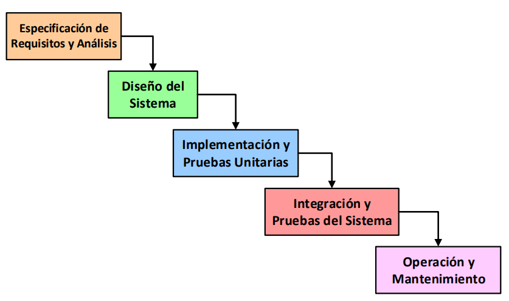
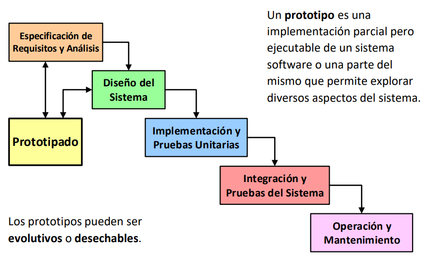
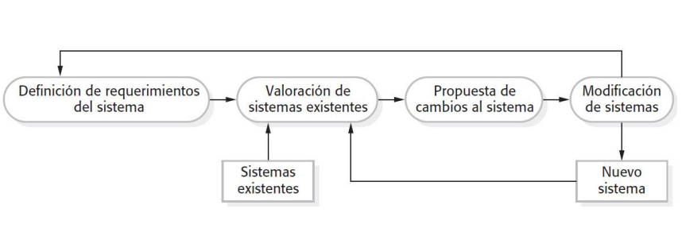
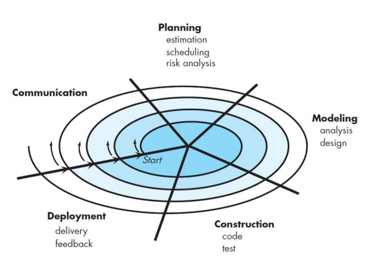

# Metodologías Tradicionales

## Tema 1

### Introducción a la Gestión de Proyectos

***

#### Definición de proyecto:
- Un proyecto es un **esfuerzo temporal** que se lleva a cabo para **crear un producto, servicio o resultado único.**
- Un proyecto es un conjunto **único** de actividades destinadas a **producir** un **resultado** definido dentro de un **marco de tiempo** establecido utilizando una asignación específica de recursos.
- Un proyecto es un proceso **único** consistente en un conjunto de actividades coordinadas y controladas con **fechas de inicio y de finalización**, llevadas a cabo para **lograr un objetivo** conforme a unos **requisitos** específicos, incluyendo las **limitaciones de tiempo, coste y recursos**.

La producción continua de bienes y/o servicios **NO es un proyecto**. Eso recibe el nombre de operaciones y están fuera del alcance y se gestionan de forma diferente a los proyectos. Son repetitivos mientras los proyectos son temporales y únicos.

#### Características de los proyectos:
Los proyectos se llevan a cabo para cumplir **objetivos** mediante la producción de **entregables**.

- _**Objetivo:**_ **Producto** a producir, **servicio** a prestar, resultado a obtener o la **combinación** de los mismos. Debe ser único y específico
- _**Entregable:**_ Cualquier **producto, servicio o resultado único y específico** o la combinación de los mismos. Puede ser **tangible o intangible**. Naturaleza social, económica, material o ambiental.

Los proyectos son **esfuerzos temporales** en el sentido de que tienen un principio y un final definidos.
Se desarrollan de forma **progresiva** de acuerdo a una planificación **temporal** a lo largo de su **ciclo de vida**.

Se **finalizan** cuando:
- Se logran los objetivos
- Se constata que no se pueden cumplir
- Se agota la financiación
- Desaparece la necesidad del proyecto o se da por terminado por conveniencia o causa legal.

Pueden involucrar a **múltiples unidades de múltiples organizaciones**.
Requieren **coordinación multidisciplinar**.
Están **limitados por tiempo, coste y/o recursos**.

#### Dirección de proyectos:
La dirección de proyectos es la **aplicación de conocimientos, habilidades, herramientas y técnicas** a las **actividades del proyecto** para cumplir con los requisitos del mismo.

|Direccion de proyectos deficiente|Direccion de proyectos eficaz|
|-|-|
|Sobrecostes|Cumplir los objetivos del proyecto|
|Incumplimiento de plazos|Gestionar las restricciones del proyecto|
|Calidad deficiente|Optimizar los recursos disponibles|
|Expansión no controlada del proyecto|Responder a los riesgos de manera continua|
|Incumplimiento de objetivos|Gestionar los cambios|
|Pérdida de reputación|Ser más predecibles|

#### Restricciones de los proyectos
Todo proyecto está restringido por:
- **Alcance**: Trabajo/actividades para producir el resultado final.
- **Tiempo**: Cantidad de tiempo para completar el proyecto.
- **Coste**: Presupuesto disponible en el proyecto para realizar las actividades en el tiempo establecido.
- Estos tres elementos determinan la **Calidad**.

>- **Maximizar simultáneamente alcance, tiempo, coste y calidad no es posible.**
>- Además, se debe realizar una adecuada gestión de **riesgos** (sería la quinta restricción).
>- El equipo de dirección debe buscar un equilibrio entre las **5 restricciones contrapuestas**.
>- El balance de las mismas dependerá de los **objetivos y características** del proyecto.

Un proyecto tiene **éxito** cuando:
- Cumple su objetivo
- Se elaboran todos los entregables esperados
- Se termina a tiempo
- Se ajusta al presupuesto

#### Programas y portafolios
- Un **programa** es un **grupo de proyectos relacionados**, cuya gestión se realiza de manera coordinada para obtener beneficios que no se obtendrían si se gestionaran de forma individual.

- Un **portafolio** es una **colección de proyectos, programas, portafolios subsidiarios y operaciones** gestionados como un grupo para alcanzar objetivos estratégicos.

### Ciclo de vida de un proyecto

***

- El **ciclo de vida** de un proyecto es la **serie de fases** por las que pasa un proyecto desde su inicio hasta su conclusión.
  - Una **fase de un proyecto** es un conjunto de actividades, relacionadas de manera lógica, que culmina con la finalización de uno o más **entregables**. Son **acotadas en tiempo** y pueden ser **secuenciales, iterativas o superpuestas**.

Todo proyecto puede configurarse dentro de un **ciclo de vida genérico** compuesto por: **Inicio, Planificación, Ejecución y Cierre**.
- **Inicio:**
  - Elaborar el acta de constitución del proyecto
  - Identificar a los interesados
  - Analizar viabilidad del proyecto
- **Planificación:**
  - Elaborar el plan para la dirección del proyecto
  - Definir alcance, cronograma y presupuesto.
  - Planificar la gestión de riesgos
- **Ejecución:**
  - Dirigir, gestionar y monitorear el trabajo del proyecto
  - Adquirir recursos

Tipos de ciclos de vida:
  - **Predictivos**: El alcance, cronograma y coste se determinan en las fases tempranas del ciclo de vida. Pueden tener etapas, pero la gestión de cambios en el alcance es complicada.
  - **Adaptativos o ágiles**: El proyecto se lleva a cabo en varias iteraciones de corta duración y su alcance se define y aprueba al comienzo de cada una.
  - **Híbridos:** Combinan los ambos tipos anteriores.

Al conjunto de fases asociadas al **desarrollo de un producto, servicio o resultado** se le denomina **ciclo de vida del desarrollo del proyecto**. Estos pueden ser: **en cascada, iterativos, incrementales, ágiles o híbridos**.

_**Nota:** Cuando se sigue un ciclo de vida híbrido se usa predictivo para los elementos bien conocidos o fijos y adaptativo para el resto de elementos en evolución_.

Los ciclos de vida de los proyectos **NO son lo mismo** que los **ciclos de vida de los productos**, los cuales representan la evolución del producto **desde el concepto hasta la entrega, la madurez y el retiro**. Por tanto, aunque guardan relación **se definen y gestionan de manera independiente**.

Al final de cada fase del ciclo de vida se lleva a cabo un **punto de revisión de fase**. En este punto se toma una de las siguientes decisiones:
- Avanzar a la siguiente fase (con o sin modificaciones)
- Finalizar el proyecto
- Permanecer en la fase
- Repetir la fase o elementos de la misma

Para definir el cilo de vida de un proyecto se debe:
- Identificar y nombrar los criterios de entrada/salida para **todas las fases del proyecto**. Esto implica identificar y nombrar todas las fases asociadas al desarrollo de productos, servicios y resultados.
- Identificar los **procesos de la dirección de proyectos** que deben realizarse en cada fase identificada.

### Introducción a la Gestión de Proyectos de Desarrollo del Software

***

#### Características del software

El software es distinto a los productos de otras ingenierías, ya que es **intangible**, se **desarrolla** (no se fabrica) y los costes se centran en el desarrollo, no la fabricación. No se estropea pero **SÍ se deteriora**.

El software es más flexible y generalmente más barato de modificar.

Necesita **métricas específicas**:
- Para estimar su **tamaño**.
- Para estimar su **esfuerzo y coste de desarrollo**.
- Para medir aspectos de su **proceso de desarrollo**.
- Para medir su **calidad**.

Las características de un software de calidad son las siguientes:

|Característica|Descripción|
|---|---|
|**Aceptación**|Debe ser aceptado por los usuarios para los que ha sido diseñado.|
|**Usabilidad**|Los usuarios para los que ha sido diseñado deben poder utilizarlo fácilmente|
|**Fiabilidad**|Debe tener una baja tasa de fallos, los fallos que se produzcan deben ser poco graves y debe ser capaz de recuperarse tras un fallo|
|**Rendimiento**|Debe tener un bajo tiempo de respuesta y hacer un consumo eficiente de recursos|
|**Mantenibilidad**|Debe ser desarrollado para que pueda ser mantenido fácilmente|

#### Proyectos de desarrollo del software

Un **proyecto de desarrollo del software** es un proyecto que requiere **desarrollar productos software** que satisfagan unos **requisitos** determinados.

Presentan características propias, con **productos, ciclos de vida, métricas y comportamiento diferente**.

### Modelos de Proceso de Software

***

Los **modelos de proceso de software** son definiciones de alto nivel de los **ciclos de vida de los productos software**. Cada modelo propone una **secuencia de actividades que conduce a la elaboración de un producto software**.

La mayoría de modelos de proceso software tienen en común las siguientes actividades:
- **Especificación de requisitos**.
- **Diseño**.
- **Implementación**.
- **Integración.**
- **Verificación y Validación**.
- **Implantación**.
- **Mantenimiento**.

#### Modelo en cascada.

Clásico:

Con retroalimentación:

Con prototipado:

#### Modelo Incremental

#### Modelo Evolutivo

#### Modelo en Espiral

**Modelo iterativo y evolutivo** dirigido por **riesgos**.

Los **riesgos** se van detectando a medida que se va evolucionando y no al final.

El gestor del proyecto ajusta el número necesario de iteraciones para completar el software.

#### Metodologías ágiles

El **desarrollo ágil de software** tiene como objetivo reducir los costes provocados por cambios a lo largo del proceso de software.

Estas metodologías definen modelos de proceso **iterativos e incrementales**. Cada iteración incluye: especificación y análisis de requisitos, diseño, implementación, integración y pruebas.

Tratan de **diseñar y construir** el software simultáneamente.

- **Scrum**: Marco de trabajo que define un conjunto de prácticas, roles, eventos y artefactos.

- **Kanban**: Método para definir, gestionar y mejorar servicios que entregan trabajo del conocimiento.

- **XP (eXtreme Programming):** Método que incluye diversas prácticas como planificación de releases e iteraciones, desarrollo guiado por pruebas, programación en pares y refactorización.

## Tema 2: Lorem ipsum

