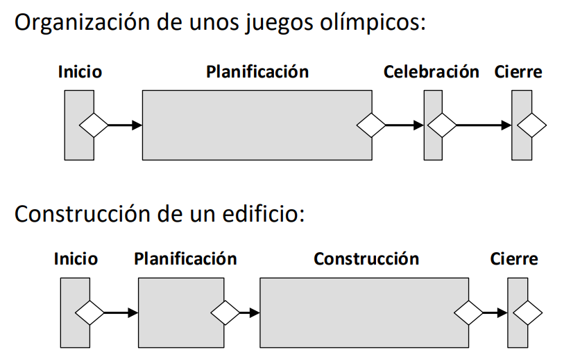
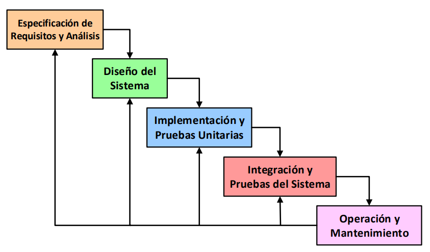
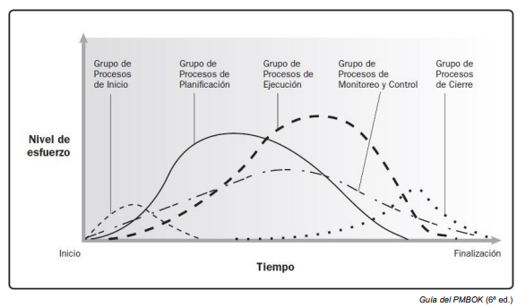
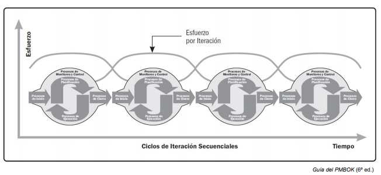
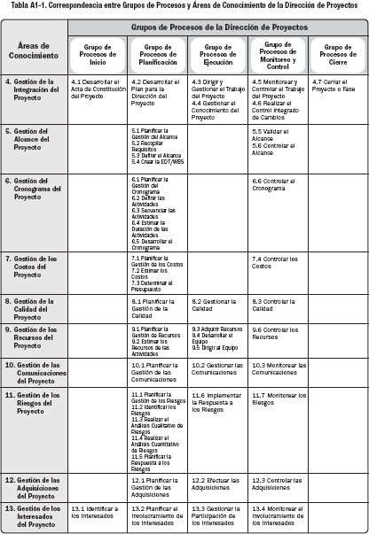
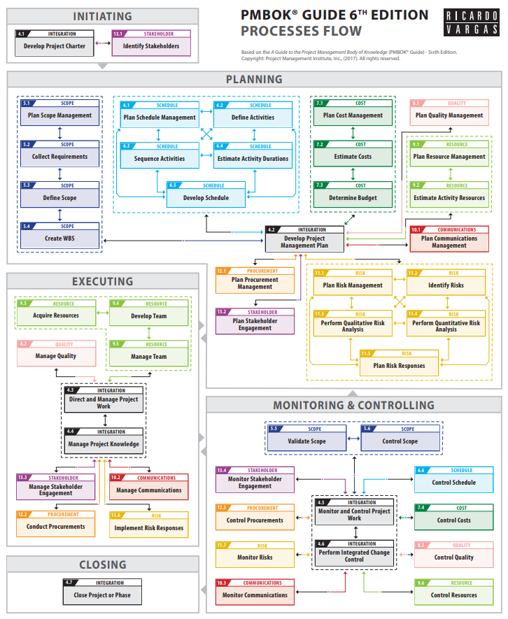
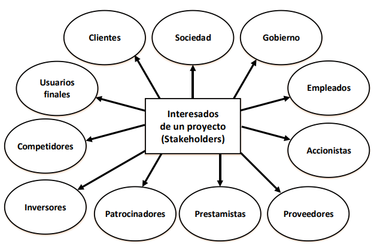
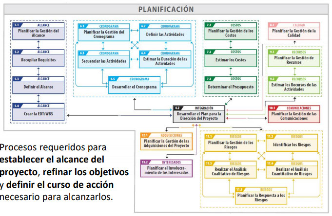
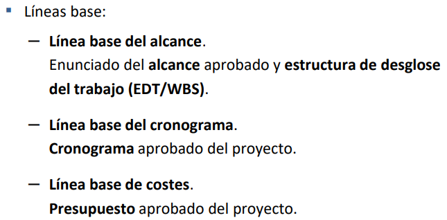
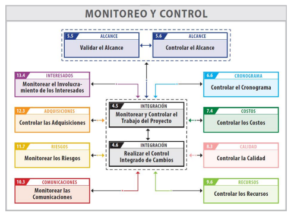

# Metodologías Tradicionales

## Tema 1

### Introducción a la Gestión de Proyectos

***

#### Definición de proyecto:
- Un proyecto es un **esfuerzo temporal** que se lleva a cabo para **crear un producto, servicio o resultado único.**
- Un proyecto es un conjunto **único** de actividades destinadas a **producir** un **resultado** definido dentro de un **marco de tiempo** establecido utilizando una asignación específica de recursos.
- Un proyecto es un proceso **único** consistente en un conjunto de actividades coordinadas y controladas con **fechas de inicio y de finalización**, llevadas a cabo para **lograr un objetivo** conforme a unos **requisitos** específicos, incluyendo las **limitaciones de tiempo, coste y recursos**.

La producción continua de bienes y/o servicios **NO es un proyecto**. Eso recibe el nombre de operaciones y están fuera del alcance y se gestionan de forma diferente a los proyectos. Son repetitivos mientras los proyectos son temporales y únicos.

#### Características de los proyectos:
Los proyectos se llevan a cabo para cumplir **objetivos** mediante la producción de **entregables**.

- _**Objetivo:**_ **Producto** a producir, **servicio** a prestar, resultado a obtener o la **combinación** de los mismos. Debe ser único y específico
- _**Entregable:**_ Cualquier **producto, servicio o resultado único y específico** o la combinación de los mismos. Puede ser **tangible o intangible**. Naturaleza social, económica, material o ambiental.

Los proyectos son **esfuerzos temporales** en el sentido de que tienen un principio y un final definidos.
Se desarrollan de forma **progresiva** de acuerdo a una planificación **temporal** a lo largo de su **ciclo de vida**.

Se **finalizan** cuando:
- Se logran los objetivos
- Se constata que no se pueden cumplir
- Se agota la financiación
- Desaparece la necesidad del proyecto o se da por terminado por conveniencia o causa legal.

Pueden involucrar a **múltiples unidades de múltiples organizaciones**.
Requieren **coordinación multidisciplinar**.
Están **limitados por tiempo, coste y/o recursos**.

#### Dirección de proyectos:
La dirección de proyectos es la **aplicación de conocimientos, habilidades, herramientas y técnicas** a las **actividades del proyecto** para cumplir con los requisitos del mismo.

|Direccion de proyectos deficiente|Direccion de proyectos eficaz|
|-|-|
|Sobrecostes|Cumplir los objetivos del proyecto|
|Incumplimiento de plazos|Gestionar las restricciones del proyecto|
|Calidad deficiente|Optimizar los recursos disponibles|
|Expansión no controlada del proyecto|Responder a los riesgos de manera continua|
|Incumplimiento de objetivos|Gestionar los cambios|
|Pérdida de reputación|Ser más predecibles|

#### Restricciones de los proyectos
Todo proyecto está restringido por:
- **Alcance**: Trabajo/actividades para producir el resultado final.
- **Tiempo**: Cantidad de tiempo para completar el proyecto.
- **Coste**: Presupuesto disponible en el proyecto para realizar las actividades en el tiempo establecido.
- Estos tres elementos determinan la **Calidad**.

>- **Maximizar simultáneamente alcance, tiempo, coste y calidad no es posible.**
>- Además, se debe realizar una adecuada gestión de **riesgos** (sería la quinta restricción).
>- El equipo de dirección debe buscar un equilibrio entre las **5 restricciones contrapuestas**.
>- El balance de las mismas dependerá de los **objetivos y características** del proyecto.

Un proyecto tiene **éxito** cuando:
- Cumple su objetivo
- Se elaboran todos los entregables esperados
- Se termina a tiempo
- Se ajusta al presupuesto

#### Programas y portafolios
- Un **programa** es un **grupo de proyectos relacionados**, cuya gestión se realiza de manera coordinada para obtener beneficios que no se obtendrían si se gestionaran de forma individual.

- Un **portafolio** es una **colección de proyectos, programas, portafolios subsidiarios y operaciones** gestionados como un grupo para alcanzar objetivos estratégicos.

### Ciclo de vida de un proyecto

***

- El **ciclo de vida** de un proyecto es la **serie de fases** por las que pasa un proyecto desde su inicio hasta su conclusión.
  - Una **fase de un proyecto** es un conjunto de actividades, relacionadas de manera lógica, que culmina con la finalización de uno o más **entregables**. Son **acotadas en tiempo** y pueden ser **secuenciales, iterativas o superpuestas**.

Todo proyecto puede configurarse dentro de un **ciclo de vida genérico** compuesto por: **Inicio, Planificación, Ejecución y Cierre**.
- **Inicio:**
  - Elaborar el acta de constitución del proyecto
  - Identificar a los interesados
  - Analizar viabilidad del proyecto
- **Planificación:**
  - Elaborar el plan para la dirección del proyecto
  - Definir alcance, cronograma y presupuesto.
  - Planificar la gestión de riesgos
- **Ejecución:**
  - Dirigir, gestionar y monitorear el trabajo del proyecto
  - Adquirir recursos

Tipos de ciclos de vida:
  - **Predictivos**: El alcance, cronograma y coste se determinan en las fases tempranas del ciclo de vida. Pueden tener etapas, pero la gestión de cambios en el alcance es complicada.
  - **Adaptativos o ágiles**: El proyecto se lleva a cabo en varias iteraciones de corta duración y su alcance se define y aprueba al comienzo de cada una.
  - **Híbridos:** Combinan los ambos tipos anteriores.

Al conjunto de fases asociadas al **desarrollo de un producto, servicio o resultado** se le denomina **ciclo de vida del desarrollo del proyecto**. Estos pueden ser: **en cascada, iterativos, incrementales, ágiles o híbridos**.

_**Nota:** Cuando se sigue un ciclo de vida híbrido se usa predictivo para los elementos bien conocidos o fijos y adaptativo para el resto de elementos en evolución_.

Los ciclos de vida de los proyectos **NO son lo mismo** que los **ciclos de vida de los productos**, los cuales representan la evolución del producto **desde el concepto hasta la entrega, la madurez y el retiro**. Por tanto, aunque guardan relación **se definen y gestionan de manera independiente**.

Al final de cada fase del ciclo de vida se lleva a cabo un **punto de revisión de fase**. En este punto se toma una de las siguientes decisiones:
- Avanzar a la siguiente fase (con o sin modificaciones)
- Finalizar el proyecto
- Permanecer en la fase
- Repetir la fase o elementos de la misma

Para definir el cilo de vida de un proyecto se debe:
- Identificar y nombrar los criterios de entrada/salida para **todas las fases del proyecto**. Esto implica identificar y nombrar todas las fases asociadas al desarrollo de productos, servicios y resultados.
- Identificar los **procesos de la dirección de proyectos** que deben realizarse en cada fase identificada.

### Introducción a la Gestión de Proyectos de Desarrollo del Software

***

#### Características del software

El software es distinto a los productos de otras ingenierías, ya que es **intangible**, se **desarrolla** (no se fabrica) y los costes se centran en el desarrollo, no la fabricación. No se estropea pero **SÍ se deteriora**.

El software es más flexible y generalmente más barato de modificar.

Necesita **métricas específicas**:
- Para estimar su **tamaño**.
- Para estimar su **esfuerzo y coste de desarrollo**.
- Para medir aspectos de su **proceso de desarrollo**.
- Para medir su **calidad**.

Las características de un software de calidad son las siguientes:

|Característica|Descripción|
|---|---|
|**Aceptación**|Debe ser aceptado por los usuarios para los que ha sido diseñado.|
|**Usabilidad**|Los usuarios para los que ha sido diseñado deben poder utilizarlo fácilmente|
|**Fiabilidad**|Debe tener una baja tasa de fallos, los fallos que se produzcan deben ser poco graves y debe ser capaz de recuperarse tras un fallo|
|**Rendimiento**|Debe tener un bajo tiempo de respuesta y hacer un consumo eficiente de recursos|
|**Mantenibilidad**|Debe ser desarrollado para que pueda ser mantenido fácilmente|

#### Proyectos de desarrollo del software

Un **proyecto de desarrollo del software** es un proyecto que requiere **desarrollar productos software** que satisfagan unos **requisitos** determinados.

Presentan características propias, con **productos, ciclos de vida, métricas y comportamiento diferente**.

### Modelos de Proceso de Software

***

Los **modelos de proceso de software** son definiciones de alto nivel de los **ciclos de vida de los productos software**. Cada modelo propone una **secuencia de actividades que conduce a la elaboración de un producto software**.

La mayoría de modelos de proceso software tienen en común las siguientes actividades:
- **Especificación de requisitos**.
- **Diseño**.
- **Implementación**.
- **Integración.**
- **Verificación y Validación**.
- **Implantación**.
- **Mantenimiento**.

#### Modelo en cascada.

Clásico:

Con retroalimentación:

Con prototipado:

#### Modelo Incremental

#### Modelo Evolutivo

#### Modelo en Espiral

**Modelo iterativo y evolutivo** dirigido por **riesgos**.

Los **riesgos** se van detectando a medida que se va evolucionando y no al final.

El gestor del proyecto ajusta el número necesario de iteraciones para completar el software.

#### Metodologías ágiles

El **desarrollo ágil de software** tiene como objetivo reducir los costes provocados por cambios a lo largo del proceso de software.

Estas metodologías definen modelos de proceso **iterativos e incrementales**. Cada iteración incluye: especificación y análisis de requisitos, diseño, implementación, integración y pruebas.

Tratan de **diseñar y construir** el software simultáneamente.

- **Scrum**: Marco de trabajo que define un conjunto de prácticas, roles, eventos y artefactos.

- **Kanban**: Método para definir, gestionar y mejorar servicios que entregan trabajo del conocimiento.

- **XP (eXtreme Programming):** Método que incluye diversas prácticas como planificación de releases e iteraciones, desarrollo guiado por pruebas, programación en pares y refactorización.

## Tema 2

### Procesos de la Dirección de Proyectos

***

Los **procesos de la dirección de proyectos** definen una serie de **actividades de dirección** cuya ejecución permite gestionar el proyecto a lo largo de toda su vida.

Cada proceso produce **una o más salidas** a partir de **una o más entradas** mediante el uso de **herramientas y técnicas** adecuadas para la dirección de proyectos.

La salida de un proceso puede dar como resultado:
- Un **entregable** del proyecto
- Una **entrada** a otro proceso

Los procesos **se relacionan entre sí** a través de las salidas que producen.

Los procesos también pueden tener **actividades superpuestas (concurrentes)**.

**Procesos de utilización única**: Son procesos que se utilizan una única vez en puntos predefinidos del proyecto. *Ejemplo: Desarrollar el Acta de Constitución del Proyecto*

**Procesos de utilización recurrente**: Son procesos que se llevan a cabo siempre que sea necesario y que pueden ocurrir en múltiples ocasiones. *Ejemplo: Adquirir Recursos*

**Procesos de utilización continua**: Son procesos que se realizan de manera continua a lo largo de todo o parte del proyecto. *Ejemplo: Controlar los costes*

La **Guía del PMBOK** agrupa los procesos en **5 grupos** que **son independientes de las fases del ciclo de vida del proyectos**. El hecho de que un proceso peertenezca a un grupo determinado no limita las fases en las que éste puede ser aplicado.

En proyectos con **ciclos de vida ágiles** se pueden emplear procesos de todos los grupos en cada **iteración**:

La **Guía del PMBOK** también agrupa los procesos en **10 áreas de conocimiento**:

#### Adaptación de la dirección de proyectos

La adaptación de la dirección de proyectos es necesaria porque **cada proyecto es único**:
- Cada proyecto tiene diferentes **restricciones contrapuestas de alcance, tiempo, costes, calidad y riesgos con importancias distintas.**
- El equipo de dirección debe **adaptar** el enfoque para gestionar estas restricciones.

La **adaptación de la dirección de proyectos** consiste en seleccionar los **procesos de la dirección de proyectos, entradas, herramientas, técnicas, salidas y fases del ciclo de vida** adecuados para gestionar un proyecto.

Para realizar la adaptación, el director del proyecto colabora con el equipo del proyecto, el patrocinador, la dirección de la organización o alguna combinación de los mismos.

### Flujo de procesos PMBOK

***

#### Grupo de Procesos de Inicio

Procesos realizados para **definir un nuevo proyecto** o nueva fase de un proyecto existente.

##### Acta de constitución del proyecto

El acta es un documento emitido por el **iniciador o patrocinador** del proyecto, que autoriza la existencia del proyecto y confiere al director de proyecto autoridad para **planificar, ejecutar y controlar el proyecto**, así como para **asignar los recursos de la organización** a las actividades del mismo.

- Su aprobación constituye el **inicio formal del proyecto**.
- Puede ser elaborada por el **patrocinador y/o director del proyecto** en colaboración con la **entidad iniciadora**.
- No es considerada un contrato

Documenta la información acerca del proyecto y el producto, servicio o resultado que el proyecto pretende producir, incluyendo:

- **Objetivos del proyecto**.
- **Descripción general**, incluyendo los **entregables** clave.
- Resumen del **cronograma de hitos**.
- **Recursos financieros**.
- **Riesgo** general del proyecto.
- Lista de interesados clave.
- Criterios de salida y de éxito.
- Niveles de autoridad.

Beneficios del proceso:

- Crea un **registro formal** del proyecto.
- Muestra el **compromiso** de la organización.
- Proporciona un vínculo directo entre el proyecto y los **objetivos estratégicos** de la organización.

Para desarrollar el acta se requiere la elaboración previa de los siguientes documentos **que se originan fuera del proyecto y de sus límites**:

- **Caso de negocio**: Enumera los objetivos y razones para iniciar el proyecto e incluye un estudio de viabilidad económica.
- **Plan de gestión de beneficios**: Describe como medir los beneficios del proyecto.
- **Acuerdos** de los diferentes involucrados del proyecto.

##### Identificar a los interesados

Los **stakeholders** son aquellas personas, grupos u organizaciones que **pueden afectar al o ser afectados por el proyecto**.

Identificar, involucrar y gestionar correctamente a los interesados es **clave** para el éxito de un proyecto.

El proceso de identificación de los interesados debería comenzar **lo antes posible** una vez que el acta de constitución del proyecto ha sido aprobada.

#### Grupo de Procesos de Planificación

##### Plan para la dirección del proyecto

Es el proceso de definir, preparar y coordinar todos los componentes del proyecto y consolidarlos en un **plan integral para la dirección del proyecto**.

Define la manera en que **el proyecto será ejecutado, monitoreado, controlado y cerrado**.

Define el **alcance, cronograma y coste** del proyecto.

Define qué **recursos** son necesarios para llevar a cabo el proyecto y los organiza.

Incluye un plan de gestión de **riesgos**.

Es una declaración pensada para ser **revisada y modificada** con frecuencia, no un compromiso inalterable.

No pretende restringir la libertad de actuación, sino ser una **base para la gestión de la ejecución y cierre del proyecto.**

Sólo puede ser modificado a través del proceso "Realizar el Control Integrado de Cambios", lo que resulta en un plan que **se elabora progresivamente** por medio de **actualizaciones controladas**.

Integra y consolida **todos los planes de gestión, líneas base e información adicional necesaria para dirigir el proyecto**.

#### Grupo de Procesos de Ejecución

Procesos realizados para **completar el trabajo definido en el plan para la dirección del proyecto** a fin de satisfacer los requisitos del proyecto.

##### Dirigir y Gestionar el Trabajo del Proyecto

Es el proceso de **liderar y llevar a cabo el trabajo definido en el plan para la dirección del proyecto** e **implementar los cambios** aprobados para alcanzar sus objetivos.

Implica **ejecutar las actividades planificadas** del proyecto para completar los **entregables** del mismo y alcanzar los objetivos establecidos.

Se asignan los **recursos disponibles** y se gestiona su uso eficiente.

El **equipo de dirección del proyecto** dirige la ejecución de las actividades.

Se recopilan **datos de desempeño del trabajo** y se comunican a los **procesos de monitoreo y control**.

Se aplican los **cambios en los planes del proyecto** que provienen de analizar estos datos.

#### Grupo de Procesos de Monitoreo y Control

Procesos requeridos para **hacer seguimiento, analizar y regular el prograso y el desempeño del proyecto**, para identificar áreas en las que **el plan requiera cambios** y para **iniciar los cambios** correspondientes.

##### Monitorear y Controlar el Trabajo del Proyecto

Es el proceso de **hacer seguimiento, revisar e informar sobre el avance general del proyecto** a fin de cumplir con los objetivos de desempeño definidos en el plan para la dirección del proyecto.

Se realiza **de forma continua a lo largo de todo el proyecto**. Consiste en **recopilar, medir y evaluar medidas**.

Permite a la **dirección del proyecto**:

- Medir y supervisar regularmente el progreso del proyecto para **identificar variaciones respecto al plan** para la dirección del proyecto.
- **Identificar áreas** que puedan requerir medidas correctivas.
- **Monitorear la implementación de los cambios** realizados.
- **Realizar pronósticos**.
- Verificar el estado de los **riesgos** del proyecto.

Permite a los **interesados comprender el estado del proyecto** en un momento dado.

##### Realizar el Control Integrado de Cambios

Es el proceso de **revisar todas las solicitudes de cambio**, **aprobar y gestionar cambios a entregables, documentos del proyecto y al plan para la dirección del proyecto; y comunicar** las decisiones.

Se realiza de **forma continua desde el inicio del proyecto hasta su finalización**.

Cualquier interesado puede solicitar cambios, los cuales **pueden ocurrir en cualquier momento a lo largo del ciclo de vida del proyecto.**

Un cambio puede impactar:
- Al **alcance, cronograma y/o costes** del proyecto
- A cualquier componente del **plan para la dirección del proyecto** u otro documento.

#### Grupo de Procesos de Cierre

Este grupo está formado por un único proceso: **“Cerrar el Proyecto o Fase”**, el cual se lleva a cabo para **completar o cerrar formalmente un proyecto**, una fase o un contrato.

Este proceso permite **archivar la información del proyecto o fase, verificar que el trabajo planificado ha sido completado y liberar los recursos de la organización**.

Este proceso comprende:

- Confirmar la entrega y aceptación formal de todos los entregables por parte del cliente.
- Transferir los productos, servicios o resultados del proyecto a la siguiente fase o a producción y/u operaciones.
- Verificar que todos los costes puedan ser asignados al proyecto y cerrar las cuentas.
- Liberar y reasignar recursos (personal, equipamiento, …).
- Ocuparse del exceso de materiales.
- Medir la satisfacción de los interesados.
- Recopilar registros, auditar el éxito o fracaso del proyecto, identificar las lecciones aprendidas y archivar la información para uso futuro.
- Analizar y documentar las razones de las acciones emprendidas en caso de que un proyecto se dé por terminado antes de su culminación.
- Elaborar los informes finales del proyecto.

### Herramientas y Técnicas empleadas en los Procesos de la Dirección de Proyectos

***

**Dirigir un proyecto** requiere seleccionar las **herramientas y técnicas** más adecuadas para su gestión y aplicarlas a las actividades del proyecto. PMBOK identifica 132 herramientas y técnicas que pueden ser utilizadas y estas son las más utilizadas:

#### Juicio de expertos:

Es una técnica en la que un **grupo de personas con formación especializada** en un área de conocimiento emite una opinión sobre un tema concreto.

Se puede utilizar para la **toma de decisiones, la recopilación de información y la interpretación de resultados**.

#### Método Delphi

Basada en **juicio de expertos**, en la cual se les dan cuestionarios a los expertos y se analizan estadísticamente.

Permite alcanzar **consensos y realizar predicciones** cuantitativas mediante un **proceso iterativo y sistemático.**

#### Brainstorming

Tiene dos partes: **generación de ideas** (todos producen y expanden ideas) y **análisis** (se agrupan ideas similares y se evalúan).

Sirve para **recopilar datos, identificar listas de ideas o soluciones, generar ideas originales**.

#### Grupos focales

Reúnen a interesados y expertos en la materia a fin de **conocer sus expectativas y actitudes respecto a un producto, servicio o resultado propuesto.**

Sirve para **recopilar datos**.

#### Análisis mediante árbol de decisiones

Se utilizan para elegir el mejor curso de acción entre varias opciones. Para ello se analizan las trayectorias alternativas y cada uno de los nodos finales representa el resultado.

Es una técnica de **análisis de datos**.

#### Mapeo mental

Consiste en la elaboración de un diagrama (mapa mental) para representar y organizar **visualmente** elementos **ligados a una idea central**.

Es una técnica de **representación de datos**

#### Presentaciones

Presentaciones de diapositivas (se presentan varios consejos y reglas para que sean más efectivas).

Es una técnica del grupo **habilidades para la comunicación**.

#### Reuniones

Pueden ser **presenciales, virtuales, formales o informales** (se presentan varios consejos y reglas para que sean más efectivas).

Se debe planificar la reunión con antelación creando una agenda con el plan de la misma y distribuirla.

Es una técnica de **gestión de un proyecto**, con el objetivo de **tomar decisiones**.

#### Gestión de reuniones

Consiste en preparar y distribuir la agenda (estableciendo los objetivos y plan de reunión), y asegurar el curso, comienzo, registros, etc. de la reunión.

Es una técnica del grupo **habilidades interpersonales y de equipo**.

#### Liderazgo

Son los **conocimientos, habilidades y comportamientos necesarios para guiar, motivar y dirigir a un equipo/organización a alcanzar sus metas de negocio**.

Es una técnica de **habilidades interpersonales y de equipo**.

## Tema 3

