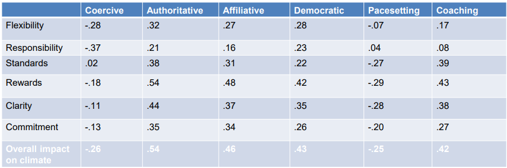
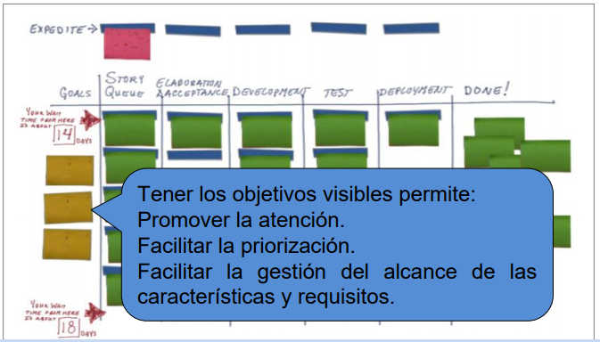

# Metodologías Ágiles (Temas 8-12)

## Tema 8

### Introducción a las metodologías ágiles, valores, principios y equipos de desarrollo

***

_Agile_ es adaptativo e iterativo, pero no todo lo adaptativo o iterativo tiene por qué ser _agile_.

Todos los **valores** se pueden resumir en:

- Aportar el **máximo valor** posible al cliente.
- Las **personas y sus interacciones** están por encima de los procesos y herramientas.
- Desarrollar **software que funcione** antes que una documentación completísima.
- La **colaboración del cliente** por encima de un contrato.
- **Responder a los cambios** por encima de seguir una planificación.

Los **principios ágiles** son:

1. La mayor prioridad es **satisfacer al cliente** mediante la **entrega temprana y continua** de software **de valor**.

2. Aceptamos **requisitos cambiantes**, incluso en etapas avanzadas. Este cambio **aporta ventaja competitiva** al cliente.

3. Entregamos software **frecuentemente**, con perioicidad desde un par de semanas a un par de meses, en ciclos lo más corto posibles.

4. Los reponsables de negocio y los desarrolladores deben **trabajar juntos diariamente** a lo largo del proyecto.

5. Construimos proyectos con profesionales motivados. Les damos el entorno y soporte que necesitan y confiamos en ellos.

6. El método más eficiente y efectivo de comunicación es la **conversación cara a cara**.

7. **Software que funciona** es la principal medida de progreso.

8. Los procesos ágiles promueven el desarrollo sostenible.

9. La atención continua a la **excelencia técnica** y los buenos diseños mejoran la agilidad.

10. **Simplicidad**: centrarse en lo esencial y evitar funcionalidades innecesarias y defectos.

11. Las mejores resultados surgen de equipos que se **auto-organizan**.

12. A intervalos regulares, el equipo reflexiona sobre cómo ser más efectivo, mejorando y ajustando su comportamiento.

Todos estos valores y principios los aplicamos en las decisiones de diseño, gestión y liderazgo y en las relaciones con el cliente y los interesados.

Para conseguir estos valores y principios, el **equipo de desarrollo** debe de ser:

- **Auto-organizado**: Cross-functional y se organiza a si mismo y su trabajo (Competente, flexible, abierto al aprendizaje, etc.)

- **Responsable**: Tiene todos los **roles** necesarios para todas las **prácticas**. **T-shaped engineers.**

### Liderazgo en metodologías ágiles

***

El liderazgo es un proceso de **influencia social** que maximiza el esfuerzo del resto, hacia la obtención de un objetivo.

Existen varios **tipos de liderazgo**:

El liderazgo personal está influenciado por la **cultura y actitud** (Cómo puedo **ayudar** y qué puedo **aprender**).

En la organización del equipo los **silos son perjudiciales**.

||Desarrollo Tradicional|Desarrollo Ágil|
|---|---|---|
|**Supuesto de partida**|Los sistemas son totalmente especificables, predecibles y se construyen mediante una planificación meticulosa y amplia|El software de calidad se desarrolla en equipos pequeños usando los principios pequeños usando los principios de mejora de diseño continuo y pruebas basados en retroalimentación|
|**Estilo de gestión**|Mando y control|Colaboración y liderazgo|
|**Gestión del conocimiento**|Explícito|Tácito|
|**Comunicación**|Formal|Informal|
|**Modelo de desarrollo**|Modelo de ciclo de vida|Modelo evolutivo con entregas|
|**Estructura deseada de organización**|Mecanicista, dirigida a grandes organizaciones|Orgánica, dirigida a organizaciones de tamaño pequeño y medio|
|**Control de calidad**|Control estricto y planificación exhaustiva. Pruebas exhaustivas y tardías|Control continuo de requisitos, diseño y soluciones. Pruebas continuas|

### Tipos de prácticas ágiles

***

Se organizan alrededor de 9 categorías principales:

**Fundamentals:**

- **Team (+ Teams)**: A team is a small group of people, assigned to the same project or effort, nearly all of them in a full-time basis.

- **Iterative development**: Agile projects are iterative as they intentionally allow for "repeating" software development activities and "revising" the same work product.

- **Incremental development**: Each successive version of the product is usable, and each builds upon the previous version by adding user-visible functionality.

- **Version control**: Is not merely "good practice" but an enabler of a number of Agile practices, such as continuous integration.

**Teams:**

- **Team (+ Fundamentals)**.

- **Facilitation**: A facilitator is a person who chooses the explicit role of conducting a meeting.

- **Heartbit retrospective**: The team meets regularly, usually adhering to the rhythm of its iterations, to reflect on the most significant events and take decisions.

- **Team room**: The team has the use of a dedicated space for the duration of the project, set apart from other's activities.

- **Pair programming (+ eXtreme Programming)**: Consists of two programmers sharing a single workstation. One uses the keybord and other focuses on overall direction. They swap roles every few minutes.

- **Niko-niko**: The team installs a calendar on one of the room's walls.Its format allows to record a graphic evaluation of their mood during that day (may be an emoticon).

- **Scrum of scrums**: A technique to scale Scrum to larger groups dividing the groups intos teams of 5-10 people.

- **Sustainable Pace (+ eXtreme Programming)**: The teams aims for a work pace they can substain indefinitely.

- **Project charter**: The team develops and mantains a high-level summary of the project's key success factors, displayed on one wall of the room.

**Scrum:**

- **Iterative development (+ Fundamentals)**

- **Timebox**: Previously agreed period of time during which a person works steadly towards completion of some goal.

- **Iterations (+ eXtreme Programming)**: Timebox during which development takes place, usually between 1 and 4 weeks.

- **Daily meeting (+ eXtreme Programming)**: Each day the team meets to bring everyone up to date. Usually they use Scrum's Three Questions. It is timeboxed.

- **Task board**: The board is divided into three groups: "To Do", "In Progress" and "Done".

- **Burndown chart**: The team displays a large graph relating the quantity of work remaining and the time elapsed.

- **Definition of done (+ Lean)**: The team agrees on a list of criteria that must be met before a product increment (often a user story) is considered "done".

- **Definition of ready**: Criteria that a US must meet prior to being accepted into the upcoming iteration.

- **Point estimates**: Agile teams prefer to express estimates in units. The most widespread unit is "story points".

- **Relative estimation**: Consists of estimating tasks by comparison or by grouping of items of equivalent difficulty.

- **Planning poker**: Playful estimation for points estimation of a user story.

- **Backlog**: List of new features, changes, bug fixes and other activities that a team may deliver in order to achieve a specific outcome.

- **Backlog refinement (+ Product Management)**: Review items on the backlog to ensure that it contains the appropriate ones, that they are prioritized and the ones at the top are ready to delivery. It occurs on a regular basis.

**Product Management:**

- **Backlog refinement (+ Scrum)**

- **Personas**: When the project calls for it the team crafts detailed biographies of fictitious users of the future product.

- **Story mapping**: Ordering user stories along two dimensions, priority on the horizontal axis and sophistication on the vertical axis.

- **Story splitting**: Consists of breaking up one US into smaller ones while preserving the property that each US has measurable business value.

- **User Stories (+ eXtreme Programming)**: The team divides up the work to be done into functional increments called US. Each story is expected to yield a contribution to the value of the overall product.

- **3 Cs**: "Card, Conversation, Confirmation", this formula captures the components of a US (Physical, discussed and agreed upon).

- **INVEST**: This acronym assess the quality of a US: "Independent, Negotiable, Valuable, Estimable, Small and Testable".

- **Incremental development (+ Fundamentals)**.

**Lean:**

- **Lead time**: Term defining the time elapsed between a custonmer placing an order and receiving the product ordered. In software domain its described as the time elapsed between the identification of a requirement and its fulfilment.

- **Kanban board**: Is a japanese term which translates into "visual board". Its columns represent the different processing states of a “unit of value”, which is generally (but not necessarily) equated with a user story.

- **Definition of done (+ Scrum)**.

**EXtreme Programming:**

- **Sustainable pace (+ Teams)**

- **Pair programming (+ Teams)**

- **Sign up for tasks**: Members normally choose which tasks to work on, rather than being assigned by a manager.

- **Daily meeting (+ Scrum)**

- **Velocity**: At the end of each iteration, the team adds up effort estimates associated with user stories completed during each iteration. This is called velocity. It helps estimate the duration of the project.

- **Frequent delivery**: An agile team frequently releases its product and listens to feedback.

- **User Stories (+ Product Management)**

- **Collective ownership**: Teams adopt conventions regarding who is allowed to modify another's code.

- **Continuous integration (+ DevOps)**: Teams practicing CI seek to minimize the duration and effort of each iteration and to be able to deliver a product version suitable for release at any moment.

- **Simple design**: A team adopting this practice bases its software strategy on refactoring, heuristics such as YAGNI, code simplicity, "design patterns", etc.

- **Refactoring**: Refactoring consists of improving the internal structure of a program while preserving its external behaviour.

- **TDD (+ Testing)**: "Test-Driven-Development" refers to a style in which coding, testing and design are tightly interwoven.

**Design:**

- **CRC cards**: "Class, Responsabilities, Collaborators" is a way to rapidly sketch and write down on index cards the names of the most salient classes involved in the feature.

- **Quick design session**: Developers handle design choices that may have far-reaching consequences by meeting during a quick session at the whiteboard, possibly using CRC cards.

- **Rules of simplicity**: A set of criteria to judge whether some code is "simple enough": code verified by automated tests, test success, no duplication, composed by the minimum number of components, etc.

- **Refactoring (+ eXtreme Programming)**

- **Simple design (+ eXtreme Programming)**

- **Ubiquitous language**: Design which consists of not using domain-specific vocabulary all the way into the product's source code.

**Testing:**

- **Role-feature**: Identify main elements described in US to start defining tests.

- **Given-When-Then**: This formula is a template intended to guide the writing of acceptance tests for a US.

- **Behaviour Driven Development**: Is a synthesis from TDD and ATDD

- **Acceptance Test Driven Development**: Involves team members with different perspectives collaborating to write acceptance tests in advance of implementing the corresponding functionality.

- **Acceptance tests**: Is a formal description of the behavior of a software product, generally expressed as an example or a usage escenario.

- **Mock objects**: A technique commonly used in the context of crafting automated unit tests. It consists of instantiating a test-specific version of a software component that imitates its usual behaviour.

- **TDD (+ eXtreme Programming)**

- **Unit tests**: Is a short program fragment written and maintained by the developers on the product team which exercises some part of the source code and checks the results.

- **Exploratory testing**: Is an approach to testing software characterized by the tester's autonomy and performing various test-related activities in an interleaved manner.

- **Usability testing**: Consists of observering a representative end user interacting with the product, given a goal to reach but no specific instructions for using the product.

**DevOps:**

- **Version control (+ Fundamentals)**

- **Automated build**: Build refers to the process that converts files and other assets under the developer's responsability into a software product in its final form.

- **CI (+ eXtreme Programming)**

- **Continuous Deployment**: Aims to minimize lead time, between development writing one line of code and this new code being used by live users, in production.

## Tema 9

### User Story Mapping

***

Es una **técnica** visual para organizar el trabajo de desarrollo de un producto en un modelo útil para:

- Ayudar a comprender los **conjuntos de características de alto valor de un producto**
- Identificar omisiones en el trabajo pendiente
- **Planificar entregas** que brinden valor a los usuarios o clientes de manera efectiva

Permite **definir y representar una lista de requisitos de un producto** mediante un **mapa en dos dimensiones**: En el eje X el **tiempo** con relación a la experiencia del usuario (primero las que experimenta antes) y en el eje Y la **importancia**.

User Story Mapping no impone ninguna técnica de estimación de priorización.

Su aplicación permite obtener un **plan de entregas** que especifique qué historias de usuario formarán parte de cada entrega.

#### Product Backlog

La **Lista de producto (Product Backlog)** es una lista ordenada de requisitos o características de un producto.

En metodologías ágiles esta lista se compone generalmente de **US**.

Habitualmente se representa con una sola dimensión pero User Story Mapping permite representarla con dos dimensiones.

#### Historias de usuario

Una **historia de usuario** es una descripción breve y simple de un requisito utilizando lenguaje entendible por el usuario: "Como \<Rol> quiero \<Funcionalidad> para \<Beneficio>"

Las US deben representar una funcionalidad pequeña del producto, que pueda ser **implementada durante una iteración/sprint**.

Para ello aplicamos el método **INVEST**:
- **Independent**
- **Negotiable**
- **Valuable**
- **Estimable**
- **Small**
- **Testable**

#### Épicas

Una **épica** es una US que es **demasiado grande para ser entregada en una iteración** y por tanto **puede ser divisible en US más pequeñas**.

Como US que son, tienen entidad propia, son **verificables y aportan valor**.

User Story Mapping emplea el término **actividad** para referirse a las épicas, y el término **tarea** para las historias de usuario.

#### Backbone

El **backbone** está formado por todos los elementos del mapa que no son historias de usuario.

Generalmente tendrá un único nivel representando el flujo de la historia (llamado **flujo narrativo**), aunque **puede tener varios niveles**, y estarán formados por agrupaciones de épicas. Todo esto se refieren como **actividades**.

Cuando el backbone se lee de izq a der, éste debe describir **cómo los usuarios hacen uso del producto**.

### Creación del backlog y el plan de entregas

***

Elaborar el backlog es un proceso complejo que requiere definir nítidamente una **solución** para los **usuarios identificados** y lograr un **entendimiento común**.

Antes de elaborar el Backlog, es posible emplear **prototipos** para la **elicitación de requisitos**.

Se pueden tomar dos aproximaciones:
- Incluir elementos describiendo **los diferentes tipos de usuario** en el backbone acompañando a las actividades
- **Categorizar** las US definiendo diferentes tipos

Una vez tenemos el Backlog, podemos **trocearlo** a fin de obtener un **plan de entregas**.

Para ello debemos **priorizar y mover las US a diferentes filas** (nunca el backbone), colocando las más importantes en la parte superior.

Para **priorizar las US** se pueden usar diferentes técnicas (Como dot voting o MoSCoW).

Tras priorizar **cada fila formará un trozo/slice**, y las US de cada una deben servir para **lograr un objetivo específico**.

Cada trozo **no constituye necesariamente una entrega/release**, sino un hito que los miembros del equipo emplearán para evaluar el progreso.

Tampoco indican las que deben ser implementadas en una iteración, sino **las que forman parte de cada versión del producto**.

Finalmente obtenemos el **plan de versiones del producto**, y también el **MVP (Minimum Viable Product)**: la entrega más pequeña capaz de lograr con éxito sus resultados deseados.

En cada entrega se debe entregar un **producto completamente funcional que los usuarios puedan utilizar**.

El producto se debe ir **mejorando** para **aportar mayor valor al cliente**.
Idealmente, las primeras entregas serán las que **aporten mayor valor y conlleven menor esfuerzo de desarrollo**.

El plan de entregas permite conocer las **funcionalidades de cada versión del producto** y planificar y conocer **el tiempo estimado en que cada versión será entregada**.

User Story Mapping se aplica generalmente durante el **inicio o planificación de un proyecto**, por tanto durante sesiones de **Agile Inception** puede resultar de gran utilidad.

**Agile Inception** es un conjunto de 10 dinámicas orientadas a enfocar a todas las personas involucradas en un proyecto hacia un mismo objetivo.

Es deseable que participe **cualquier persona que contribuya a la ejecución exitosa del proyecto**.

Permite **reducir las incertidumbres y poner en común a las partes involucradas**.

Se realiza durante el **inicio o planificación de un proyecto**, y abarca dinámicas para **discutir de manera creativa sobre el producto que se quiere construir**. También facilita la definición de un **MVP**.

#### Aplicación de USM empleando Valor de Negocio y Story Points

Se pueden priorizar las US en base a su **valor de negocio (BV)** y estimando su esfuerzo de desarrollo empleando **puntos de historia (SP)**.

No es una aplicación general de USM, sino una **adaptación con diferencias**.

1. Se crea el **Product Backlog**

2. Se asigna a cada US un **BV**, para ello se establece un BV total que se reparte entre ellas.

3. Se estima el esfuerzo de cada US en **SP**, empleando técnicas como el **Planning poker**.

4. Una vez anotado el BV y SP, se calcula el **BV y SP para cada una de las actividades** como la suma de sus componentes inferiores.

5. Se priorizan las US **según su BV**. De este modo, si dos US tienen el mismo BV estarán en la misma fila, y dos historias situadas en la misma columna no pueden tener el mismo BV. Sin embargo se pueden incluir en una misma fila dos US con BV distinto.

6. Se obtiene un **plan de entregas/releases** de la manera convencional, troceando el Backlog.

## Tema 10

### SCRUM

SCRUM es una metodología de **gestión de proyectos ágiles** que nos ayuda a centrarnos en la aportación del **mayor valor posible** al negocio minimizando el tiempo de desarrollo.

Es el cliente/negocio el que establece las **prioridades**.

Son equipos **autogestionados**, los cuales determinan la mejor manera de entregar las **características más prioritarias** exigidas por el negocio.

Al final de cada iteración los interesados pueden ver el software, que deberá funcionar en el momento de la entrega.

**Flexibilidad+adaptabilidad+productividad**.

**NO** impone ninguna técnica/método de desarrollo en particular.

Los valores y principios de SCRUM son:
- Compromiso, coraje, foco, apertura, respeto, transparencia, inspección, adaptación.

Los **roles de SCRUM** son:
- **SCRUM Master**: Es un coach y profesor, **NO es el líder del equipo**. Debe estar dedicado **a tiempo completo**. Puede venir de cualquier disciplina, pero debe conocer los aspectos **técnicos**.

- **Product owner**: Es **UNA** persona. Es responsable de identificar características del procucto, trasladándolas a una lista de prioridades. Puede ser la misma persona que el cliente, y interactúa activa y regularmente con el equipo de desarrollo revisando los resultados de cada sprint.

- **Equipo de Desarrollo**: Es multifuncional, autoorganizado y decide cuántos ítems se preparan en cada sprint. _Evitan_ trabajar en múltiples proyectos, y no hay diferencias de jerarquía.

### Flujo de trabajo en SCRUM

***

Se basa en **tres pilares** y es alternativo al control predictivo basado en planes.

- **Transparencia**: Todos los participantes son transparentes en su día a día, la confianza es la base.

- **Inspección**: Todos revisan el trabajo, no hay supervisor.

- **Adaptación**: Mejora continua, todos participan en el proceso.

Para el control adaptativo/empírico se realizan **ceremonias**:
- **Daily meeting**: Inspeccionar cómo progresa el sprint, revisando los objetivos y optimizando el día a día.
- **Sprint review**: Inspeccionar cómo progresa el producto, revisando si se han alcanzado los objetivos y la evolución del valor.
- **Sprint planning**: Prepara el trabajo y el valor a realizar en la iteración.
- **Sprint retrospective**: Reflexiona sobre el trabajo realizado.

Existen tres fases: **Pre-game, Desarrollo y Post-game**.

### Prácticas y ceremonias en SCRUM

***

> También se realiza el product Backlog, Sprints e Incrementos de producto como en User Story Mapping, salvo con algunas diferencias (el backlog es en un formato distinto).

Partes del **Sprint Planning**:
1. Product Owner, Equipo de Desarrollo, Scrum master. Discutir **el qué** del sprint y revisar la prioridad del product backlog.
2. Equipo de Desarrollo, Scrum master, Product Owner. Discutir **el cómo** del sprint y decidir cuánto trabajo se completará.

**Reunión diaria**: Debe ser de 15 minutos, máximo. **Equipo de desarrollo**, Scrum master, product owner. Cada miembro responde a "¿Qué hiciste ayer?", "¿Qué harás hoy?" y "¿Hay algún obstáculo en tus tareas?".

**Revisión del sprint**: Inspección y adaptación del incremento de producto. Equipo de desarrollo, Product Owner, Scrum Master y otros interesados. Se presenta como una demo. Tiene carácter informal y dura 1h por semana de sprint.

**Reunión retrospectiva**: Inspección y adaptación del proceso y el entorno. Se discute **qué funciona, qué no funciona y cómo mejorar**.

Las estimaciones del flujo de trabajo en SCRUM se hacen en función de la **velocidad**, que es la cantidad de trabajo realizado.

## Tema 11

### Técnicas de estimación en Metodologías Ágiles

Durante un proyecto, es necesario estimar: **Recursos, planificación temporal y costes**, de forma en que se puedan llegar a contratos y realizar seguimientos.

Los **puntos de historia** son la unidad de medida del **tamaño relativo** de las tareas de desarrollo del software o de las US.

El tamaño de un punto de historia es **determinado por cada equipo y depende de la referencia** que tome el equipo. Para ello, se determina una tarea/US que tenga un **tamaño nominal de referencia**.

Los Story Points (SP) son **medidas propias de cada equipo** que no permiten comparaciones entre equipos diferentes.

Se pueden emplear varias escalas para representar los valores, como listas de valores (XS, S, M, L, XL) ó numéricas.

Los SP **NO MIDEN TIEMPO**, sino tamaño relativo. Además, el tamaño **no es linealmente proporcional a su duración/tiempo de desarrollo**.

#### Planning poker

El **planning poker** es una técnica gamificada **basada en el consenso** para calcular estimaciones principalmente de **esfuerzo** o **tamaño relativo** de **US**.

Se utiliza mucho en **SCRUM** y **XP**.

Su objetivo principal es **evitar el sesgo de anclaje** producido cuando estimas conociendo una estimación previa.

Por tanto, Planning Poker especifica que todas las cifras deben ser **propuestas de forma simultánea**.

Se utiliza una **baraja de cartas** con **números distintos** (secuencia de Fibonacci o similar) y símbolos para indicar incertidumbre o otras situaciones y un **temporizador** para limitar el tiempo de discusión de cada característica.

Además de los números los símbolos suelen ser:
**?**=Incertidumbre, **∞**=Imposibilidad de realizar, **Taza**=Descanso y **Rey**=Demasiado grande para estimar.

El uso de barajas numeradas pretende:
- **Acelerar el proceso de estimación**.
- Reflejar la **incertidumbre**, evitando la posible falsa sensación de precisión.
- Fomentar la **división en US más pequeñas**.

#### Técnicas de Priorización

**Dot voting**: Técnica de **priorización** en la que los participantes votan sobre la **importancia** empleando un **número limitado de pegatinas**.

**MoSCoW**: Técnica de **priorización** en las que las **características de un producto/servicio** se clasifican en **Must Have, Should Have, Could Have y Won't Have**.

**Matriz de Eisenhower**: Técnica de **priorización** en la que se clasifican según si son **urgentes y/o importantes**.

## Tema 12

### Kanban: Principios y roles

Hay dos roles principales en Kanban:

- **Gestor de solicitud de servicio (Service request manager)**: Gestiona la demanda y requisitos dentro de Kanban, manejando las relaciones con Stakeholders y fomentando la transparencia. _Product Manager, Product Owner o Service Manager_.
- **Gestor de servicio de entregas(Service delivery manager)**: Responsable del flujo de trabajo dentro de Kanban y/o de determinados ítems del mismo. _Flow manager, Delivery manager, Flow master_.

Los principios de Kanban son:
1. **Visualización**: Descomponer el flujo de trabajo en pasos claros, cada uno con su columna. Colocar las tareas en post-it de distinto color según el tipo de trabajo. Se van moviendo las tareas hasta que se finalicen a la derecha.

2. **Limitar el WIP**: Se intenta limitar el número de tareas en estados como "In progress".

3. **Gestionar el flujo**: Para evitar fricciones entre equipos se crea un buffer de capacidad limitada entre dos equipos.

4. **Explicitar las políticas**: Las decisiones tomadas se deben de hacer explícitas.

5. **Crear bucles de feedback**

6. **Mejora y evolución**: La mejor herramienta de Kanban para medir el rendimiento es el diagrama de flujo acumulativo (**Cummulative Flow Chart**). Cada día para cada columna se marca cuántas tareas hay en ella o más abajo.

### Cómo preparar a un equipo con Kanban

1. **Definir un flujo de proceso de trabajo**

2. **Organizar una pizarra Kanban visual**

3. **Definir el límite de cada columna**

4. **Colocar los objetivos prioritarios a la izquierda**

5. **Mover las tarjetas cuando se completan**

6. **Usar las fechas para calcular los ciclos de tiempo**

Se deben descomponer los procesos grandes en tareas cuando lleva más de **un par de días** completarlos o requiere de **múltiples personas colaborando** en su finalización.

En retrospectiva, un sistema Kanban, aunque simple, ayuda a enfocar el equipo hacia los **ciclos de tiempo** del trabajo entregado y ayuda a detectar **cuellos de botella**.

